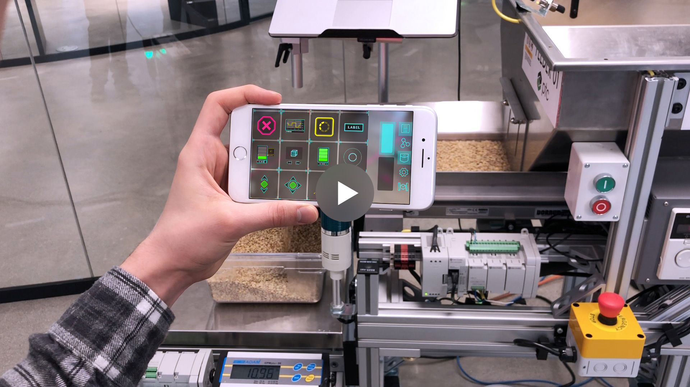
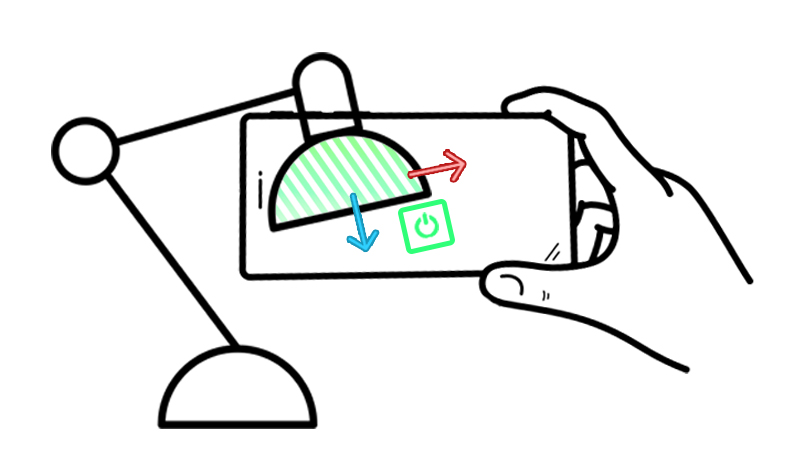
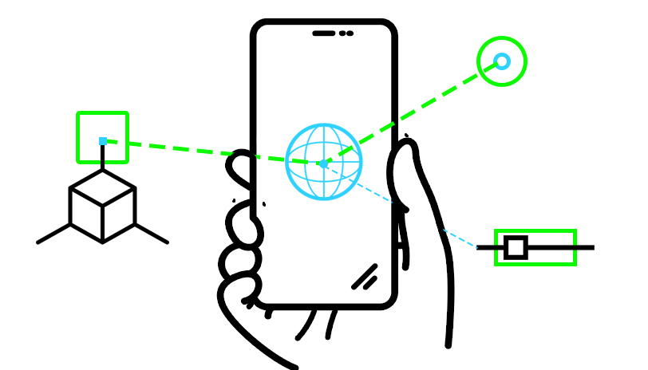
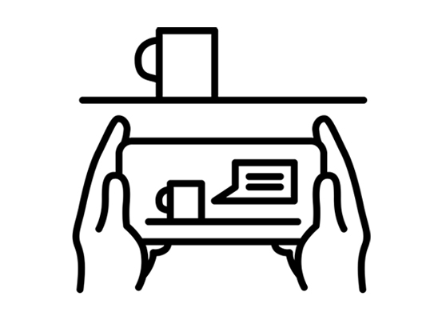
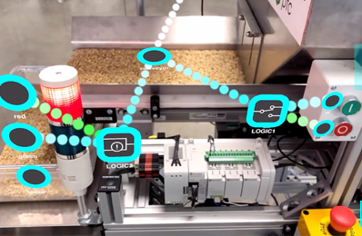
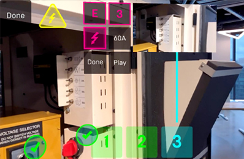

#### A sandbox for Spatial Computing Interfaces
> Use Spatial Tools to program machines, robots and digital user interfaces  using Augmented Reality on your environment.

  

    
  

  

     
  

  

    
  

  

    Fourth column
  

  

    <h2>Vuforia Spatial Toolbox</h2>
    <h4>A sandbox for Spatial Computing Interfaces</h4>
    
Program machines, robots and digital user interfaces using Augmented Reality on your environment.

  

  

    <a class="button is-primary is-pulled-right" href="https://github.com/ptcrealitylab/vuforia-spatial-toolbox-documentation/blob/master/startSystem/startSystem.md">
      Get Started
    </a>
  

  

    
  

  

    
  

  

    
  

|   | | |
| ------| -----------| -----------|
| Spatial Tools | Spatial Programming  | Spatial Robotic UI |

[Get Started](https://github.com/ptcrealitylab/vuforia-spatial-toolbox-documentation/blob/master/startSystem/startSystem.md)

### What is Vuforia Spatial Toolbox? (video placeholder)

<iframe src="https://www.youtube.com/embed/JLP2t7yymnQ?rel=0" frameborder="0" allow="autoplay;" allowfullscreen class="video" style="position: absolute;top: 0; left: 0; width: 100%; height: 100%;"></iframe>

<video style="width:100%" controls>
  <source src="https://github.com/ptcrealitylab/vuforia-spatial-toolbox-documentation/raw/master/resources/testVideo.mp4" type="video/mp4">
   
</video>

### What do I use Vuforia Spatial Toolbox for?

|  |  |  |
| ------| -----------| -----------|
| 1. Generate 2D and 3D AR content around you  | 2. Attach Spatial Tools and AR  Content to any physical object | 3. Program hardware system using AR interfaces |

### Access our Tutorials:

| [Make Tools](https://github.com/ptcrealitylab/vuforia-spatial-toolbox-documentation/tree/master/make%20tools) | [Use the toolbox](https://github.com/ptcrealitylab/vuforia-spatial-toolbox-documentation/tree/master/use) |
| --------------- | ----------------- |
| [Understand the system](https://github.com/ptcrealitylab/vuforia-spatial-toolbox-documentation/tree/master/understandSystem) | [Make hardware interfaces](https://github.com/ptcrealitylab/vuforia-spatial-toolbox-documentation/tree/master/interfaceWithHardware) |

### Made with Vuforia Spatial Toolbox

|  | | |
| ------| -----------| -----------|
| [Feeder Machine](https://www.ptc.com/en/about/reality-lab/portfolio/research/editing-reality)| [AGV path planning](https://www.ptc.com/en/about/reality-lab/portfolio/research/kinetic-ar)| [Lock out Tag out](https://www.ptc.com/en/about/reality-lab/portfolio/experiment/editing-ar-in-space) |
