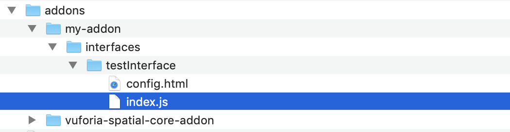
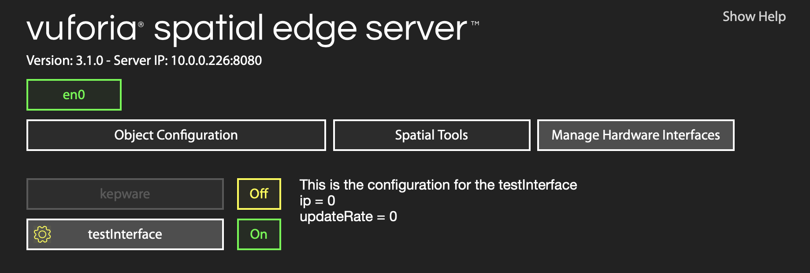
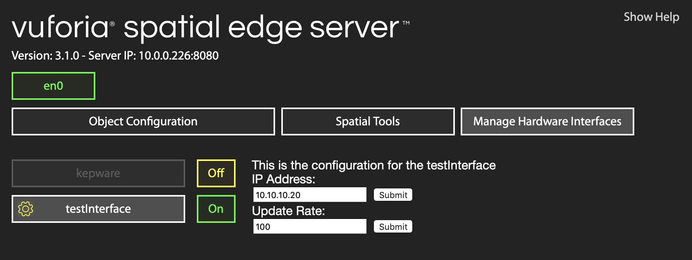

# How to add configurable settings to your hardware interface

When you run your server at least once, there will be a settings.json file generated to hold any
settings of your hardware interface. It goes at the path
`~/Documents/realityobjects/.identity/[hardware-interface-name]/settings.json`

By default, it will be generated to look like this:

```json
{
    "enabled": true
}
```

Toggling your hardware interface on or off in "Manage Hardware Interfaces" view of the web
dashboard will automatically write new values to the "enabled" property in the settings.json.

Hardware interfaces can load these settings into their index.js with the line:

```js
var settings = server.loadHardwareInterface(__dirname);
```

To read the "enabled" value from the settings, you can use:

```js
exports.enabled = settings('enabled')
```

You can manually edit the settings.json with additional properties that you can read the same way.
For example, if the contents of your settings.json looks like:

```json
{
    "enabled": true,
    "ip": "10.10.10.10",
    "updateRate": 120
}
```

Then you can read in these new properties using `exports.ip = settings('ip')` and
`exports.updateRate = settings('updateRate')`

If you don't want to have to manually edit the settings.json file to update the value, there is a
way to configure them through the web dashboard UI.

First, make sure that `exports.configurable = true` in your index.js. Then you can expose certain
properties to the web dashboard by defining a specific variable in your hardware interface index.js
called `exports.settings`

```js
// These settings will be exposed to the webFrontend to potentially be modified
exports.settings = {
    ip: settings('ip'),
    updateRate: settings('updateRate')
};
```

The exports.settings has the option to include more metadata about each property, but for now we
just include the name of the setting and the current value that it reads from settings.json.

Now create a new file in your hardware interface called `config.html`. This will be loaded into
an iframe on the "Manage Hardware Interfaces". Before we edit its contents, lets double check
that the structure is set up the right way. Your directory tree should look something like this:



Your index.js will have a lot more code in it than mine, but the minimal amount you need for this
tutorial is:

```js
var server = require('@libraries/hardwareInterfaces');
var settings = server.loadHardwareInterface(__dirname);

exports.enabled = settings('enabled');
exports.configurable = true;

if (exports.enabled) {
    // These settings will be exposed to the webFrontend to potentially be modified
    exports.settings = {
        ip: settings('ip'),
        updateRate: settings('updateRate')
    };

    console.log('saved ip: ' + exports.settings.ip);
    console.log('saved updateRate: ' + exports.settings.updateRate);
}
```

Now open the config.html file and give it these contents:

```html
<!DOCTYPE html>
<html lang="en">
<head>
    <meta charset="UTF-8">
    <title>Hardware Interface Configurator</title>
    <style>
        body {
            color: white;
            font-family: "Helvetica Neue", Helvetica, Arial, sans-serif;
        }
    </style>
</head>
<body>
<div id="introduction"></div>
<div id="settings">
    <div id="ip"></div>
    <div id="updateRate"></div>
</div>

<script>
    // 1. make sure you have this variable in your code exactly like this, or it won't work
    var realityServer = {
        hardwareInterfaceName: {/*replace HardwareInterfaceName*/},
        hardwareInterface: {/*replace HardwareInterface*/}
    }; // these get injected from the server webFrontend.js

    window.onload = function() {
        document.getElementById('introduction').innerText = 'This is the configuration for the ' + realityServer.hardwareInterfaceName;
        // 2. read the current values of each saved settings
        document.getElementById('ip').innerText = 'ip = ' + realityServer.hardwareInterface.settings.ip;
        document.getElementById('updateRate').innerText = 'updateRate = ' + realityServer.hardwareInterface.settings.updateRate;
    };
</script>
</body>
</html>
```

*Note: don't replace the /\*replace HardwareInterfaceName\*/ and /\*replace HardwareInterface
\*/ comments yourself – those are instructions for the server, not for you. When the server runs
, it will search for those comments and inject the right values from the server.*

If you restart your server, go to the "Manage Hardware Interfaces" view, and click on the little
yellow gear next to the name of your hardware interface, you should see the config.html page
load into the view.



You'll see the default values it reads from each of the settings we set up in the index.js file
(they default to 0).

Now lets add some UI so we can change these values and write the new values back to the server.
You can make you UI as fancy as you want, but here's the simplest example. Update your config.html
to this:

```html
<!DOCTYPE html>
<html lang="en">
<head>
    <meta charset="UTF-8">
    <title>Hardware Interface Configurator</title>
    <style>
        body {
            color: white;
            font-family: "Helvetica Neue", Helvetica, Arial, sans-serif;
        }
    </style>
</head>
<body>
<div id="introduction"></div>
<!-- 1. Update the HTML to have a textfield and submit button for each setting -->
<div id="settings">
    <div id="ip">
        <form>
            <label>IP Address:</label><br/>
            <input type="text" id="ipInput">
            <input type="submit" value="Submit" id="ipSubmit">
        </form>
    </div>
    <div id="updateRate">
        <form>
            <label>Update Rate:</label><br/>
            <input type="text" id="updateRateInput">
            <input type="submit" value="Submit" id="updateRateSubmit">
        </form>
    </div>
</div>

<script>
    var realityServer = {
        hardwareInterfaceName: {/*replace HardwareInterfaceName*/},
        hardwareInterface: {/*replace HardwareInterface*/}
    }; // these get injected from the server webFrontend.js

    window.onload = function() {
        document.getElementById('introduction').innerText = 'This is the configuration for the ' + realityServer.hardwareInterfaceName;
        // 2. Update to read the current values into the textfield value
        document.getElementById('ipInput').value = realityServer.hardwareInterface.settings.ip;
        document.getElementById('updateRateInput').value = realityServer.hardwareInterface.settings.updateRate;
        
        // 3. when click on submit buttons, write to server
        document.getElementById('ipSubmit').addEventListener('click', function() {
            realityServer.hardwareInterface.settings.ip = document.getElementById('ipInput').value;
            realityServer.writeHardwareInterfaceSettings('ip', function(response) { console.log(response); });
        });

        document.getElementById('updateRateSubmit').addEventListener('click', function() {
            realityServer.hardwareInterface.settings.updateRate = document.getElementById('updateRateInput').value;
            realityServer.writeHardwareInterfaceSettings('updateRate', function(response) { console.log(response); });
        });
    };

    // 4. Include these last two functions to be able to write to the server
  	// Writes your settings to the server in the correct format
    realityServer.writeHardwareInterfaceSettings = function(settingName, callback) {
        realityServer.sendPostRequest('/hardwareInterface/' + realityServer.hardwareInterfaceName + '/settings/', function (state) {
            if (state === 'ok') { console.log('successfully wrote settings'); }
            callback(state);
        }, JSON.stringify({ settings: realityServer.hardwareInterface.settings }));
    };

    // Helper function for making a POST request
    realityServer.sendPostRequest = function(url, callback, body) {
        if (!body) { body = ""; }
        var req = new XMLHttpRequest();
        try {
            req.open('POST', url, true);
            req.setRequestHeader('Content-Type', 'application/json;charset=UTF-8');
            req.onreadystatechange = function () {
                if (req.readyState === 4) {
                    if (req.status === 200) {
                        if (req.responseText) { callback(req.responseText); }
                    } else {
                        callback("err");
                    }
                }
            };
            req.send(body);
        } catch (e) {
            callback("err");
            console.log("could not connect to" + url);
        }
    };
</script>
</body>
</html>
```

Now your web dashboard should look like this:



When you type in new values and press submit, they will get saved to the settings.json file. Try
opening up the settings.json file to check that your new values are there. At this point, mine
looks like:

```
{
    "enabled": true,
    "ip": "10.10.10.20",
    "updateRate": "100"
}
```

Right now, you need to restart your server before your hardware interface index.js will get the
new values. If you want to get the new values in index.js as soon as someone changes them on the
web dashboard, you can add this to your index.js:

```js
server.addEventListener('reset', function() {
  // reload the settings from settings.json when you get a 'reset' message
  settings = server.loadHardwareInterface(__dirname);
  console.log('settings were updated: ', settings);
});
```

The final index.js template looks like this:

```js
var server = require('@libraries/hardwareInterfaces');
var settings = server.loadHardwareInterface(__dirname);

exports.enabled = settings('enabled');
exports.configurable = true;

if (exports.enabled) {
    // these settings will be exposed to the webFrontend to potentially be modified
    exports.settings = {
        ip: settings('ip'),
        updateRate: settings('updateRate')
    };

  	// these are the values when the server first loads
    console.log('saved ip: ' + exports.settings.ip);
    console.log('saved updateRate: ' + exports.settings.updateRate);

  	// these are the values anytime someone edits them on the web dashboard
    server.addEventListener('reset', function() {
        settings = server.loadHardwareInterface(__dirname);
        console.log('settings were updated');
        console.log('new ip = ' + settings('ip'));
        console.log('new updateRate = ' + settings('updateRate'));
    });
}
```

#### Where to go from here

You can make the config.html look however you want, and save whatever types of values to your
settings. For example, you could add drop-down menus to select between different options, or an
entire web app to create a complicated JSON object and store that in a variable that your
hardware interface has access to.

You can also take a look at the config.html file for the kepware interface for more advanced
behavior. This config file read additional metadata, such as defaultValue, helpText, and type
about each settings property, and uses that to dynamically create a settings page with entries
for each property, rather than manually typing out the HTML for each element.
