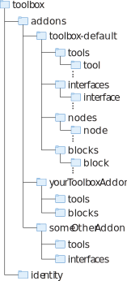

# Introduction

<!------>

To build new tools, you need to know a view basics:

1. All data is stored, processed and handled via nodes.
2. Nodes are little programms that live in the Spatial Edge Server. Some are visible to the user in physical space, some are hidden and only serve as data endpoints. Nodes can represent the physical functionality of a real world object, or just a virtual functionality of a spatial tool.
3. No matter what functionality a node has, it always belong to a Tool and Tools are attached to objects in space.
4. Node templates are stored on the server and instantiated into your tool everytime a new Tool is placed into the world.

The following APIs will help you to define how a spatial tool behaves, how it connects to the Edge Server and how it instantiates the nodes.

<!--- <br clear="right"/> --->

# Create new Tools
What is a spatial tool? It is like any other web application just with a spatial context component to it. This means, a plain HTML web application is located hovering in space and a webGL application uses a full screen web frame that can use any webGL framework to possition content in physical space.

How to get started? Create the following folderstructure within the vuforia-spatial-edge-server folder: ```/addons/<yourAddon>/tools/<newToolName>```. Place your spatial tool into this folder. Startpage is index.html

The following APIs will help you to configure your spatial tool, allow the right visualisation within the Spatial Toolbox, connect with other tools and use the logic capabilities of the Spatial Toolbox. 


 Your tools will be available to all objects that are hostet from the server they are stored on. This means, if one of your objects is visible in the Spatial Toolbox, the Spatial Toolbox can make use of them.


## API Reference


#### Initialize the Javacript Library within your Spatial Tool
Include the Spatial Toolbox functionality by instancing as following in your Java Script code:

```javascript
var spatialTool = new SpatialTool();
```

### Communication with other Spatial Tools
The Vuforia Toolbox allows each tool to communicate with other tools that are curently visible in the Spatial Toolbox.


##### sendGlobalMessage
Send messages that broadcast to all other spatial tools currently visible in the Spatial Toolbox.

```javascript
spatialTool.sendGlobalMessage("Hello World");
```
##### sendMessageToFrame
Message to a specific frame via frameKey

```javascript
spatialTool.sendGlobalMessage("destinationToolUUID", "Hello World");
```

<!---
##### sendCreateNode
Create a new node that belongs to the spatial tool.

```javascript
spatialTool.sendCreateNode("nodeName", x, y, attachTogroundplane, noDoublicate);
```

##### initNode
Create a node on that frame

```javascript
spatialTool. initNode(name, type, x, y, scale, default);
```

##### sendMoveNode
Move a node around
name, x,y

##### sendResetNodes
Removes all nodes from frame
()
--->

##### addGlobalMessageListener
Allows a spatial tool to listen to messages broadcasted by other spatial tools.

```javascript
spatialTool.addGlobalMessageListener(function(e){
  console.log(e);
});
```
##### addFrameMessageListener
Only listen to messages that are addessed to this specific spatial tool.

```javascript
spatialTool.addFrameMessageListener(function(e){
  console.log(e);
});
```

### Subscribe to Matrices
The Spatial Toolbox allows every spatial tool to subscribe to a varaiaty of matrices. These matrices can be used for example to calculate the distance to other spatial tools or they allow the use of webGL for spatial tools that require 3D content.


##### subscribeToMatrix
Subscribe to the modelView and projectionMatrix. These matrices locate the spatial origin point for your tool relative to the object the tool is attached to. This can be an object or world object.

```javascript
spatialTool.subscribeToMatrix();
```

##### subscribeToScreenPosition
Subscribe to the 2D screen position for a 3D spatial tool position in space. 

```javascript
spatialTool.subscribeToScreenPosition();
```

##### subscribeToDevicePoseMatrix
Subscribe to the devicePoseMatrix. This matrix describes where the device is located in space relative to the world object origin.

```javascript
spatialTool.subscribeToDevicePoseMatrix();
```


##### subscribeToAllMatrices
Subscribe to the modelView matrices for all visible tools.

```javascript
spatialTool.subscribeToAllMatrices();
```

##### subscribeToGroundPlaneMatrix
Subscribe to the groundplane Matrix. This matrix will match the world object origin once the world object is seen by the device.

```javascript
spatialTool.subscribeToGroundPlaneMatrix();
```

##### addMatrixListener
Listen to modelView Matrix updates for your single spatial Tool. It only works once subscribeToMatrix() is called. This listener is synchronized with the video update rate. Use the callback of this listener to synchronize animations.

```javascript
spatialTool.addMatrixListener(function(e,f){
  modelview = e;
  projection = f;
});
```

##### addAllObjectMatricesListener
Listen to modelView Matrix updates for ALL visible spatial tools. It only works once subscribeToAllMatrices() is called. This listener is synchronized with the video update rate. You can use the callback of this listener to synchronize animations.

```javascript
spatialTool.addAllObjectMatricesListener(function(e,f){
  allModelview = e; // object of matrices arrays
  projection = f;
});
```

##### addDevicePoseMatrixListener
Listen to device pose Matrix updates from your device. It only works once the related subscription is called. This listener is synchronized with the video update rate.

```javascript
spatialTool.addDevicePoseMatrixListener(function(e,f){
  devicePose = e;
  projection = f;
});
```

##### addScreenPositionListener
Listen to the 2D screen position for any spatial tool. It only works once the related subscription is called. This listener is synchronized with the video update rate.

```javascript
spatialTool.addScreenPositionListener(function(e){
  screenPose = e; // object with x and y property
});
```

##### cancelScreenPositionListener
Remove all matrix listeners.

```javascript
spatialTool. cancelScreenPositionListener();
});
```

##### getPosition

Returns a number for translation distance and position between the spatial tool and the device.

```javascript
x =  spatialTool.getPositionX();
y =  spatialTool.getPositionY();
z =  spatialTool.getPositionZ();
```

##### getProjectionMatrix
Returns the current projection Matrix in the format m[16]

```javascript
projectionMatrix =  spatialTool.getProjectionMatrix();
```

##### getModelViewMatrix
Returns the current modelView Matrix in the format m[16]

```javascript
ModelViewMatrix =  spatialTool.getModelViewMatrix();
```

##### getGroundPlaneMatrix
Returns the current groundPlane Matrix in the format m[16]

```javascript
groundPlane =  spatialTool.getGroundPlaneMatrix();
```

##### getDevicePoseMatrix
Returns the current device pose Matrix in the format m[16]

```javascript
devicePose =  spatialTool.getDevicePoseMatrix();
```

##### getAllObjectMatrices
Returns all current modelView Matrices in the format ```{"objectUuid": m[16], ...}```

```javascript
allMatrices =  spatialTool. getAllObjectMatrices();
```

### Control AR Screen Position
Spatial Tools can exist of a simple HTML page or webGL content. Some tools require fullscreen modes or persist in space even the related object is not visible. WebGL content always requite a fullscreen mode since the webgl context takes over the spatial transformations.

##### setFullScreenOn
Set your tool to fullscreen mode. Use this non spatial 2D UIs or any WebGL context.

```javascript
spatialTool.setFullScreenOn();
```
##### setFullScreenOff
Switches the full screen mode off and attaches the tool back to its spatial position.

```javascript
spatialTool.setFullScreenOff();
```
##### setStickyFullScreenOn
Set your tool to permanent fullscreen mode. Use this mode for 2D UI screens, so that the UI does not dissapear when the attached object is out of view. 

```javascript
spatialTool.setStickyFullScreenOn();
```

##### setStickinessOff
Remove the stickyness from the Fullscreen mode.

```javascript
spatialTool.setStickinessOff();
```

##### setExclusiveFullScreenOn
Set your tool to permanent fullscreen mode. This mode will remove any other fullscreen mode that is called with the same exclusivity. The callback is called when the fullscreen mode is killed.

```javascript
spatialTool.setExclusiveFullScreenOn(callback);
```

##### setExclusiveFullScreenOff
Switches the exclusive full screen mode off and attaches the tool back to its spatial position.

```javascript
spatialTool.setExclusiveFullScreenOff();
```

### Media Content
These functions help to record videos, images or use the device buildin keyboard.

##### startVideoRecording
The Spatial Toolbox will start recording the screen in the background. The final video will automatically be saved once the video is stoped and attached to your spatial tool.

```javascript
spatialTool.startVideoRecording();
```

##### stopVideoRecording
Stop the video recording and attach it to your tool.
The callback provides the video URL.

```javascript
spatialTool.startVideoRecording(function(e){
var videoURL = e;
});
```

##### announceVideoPlay
On certain Mobile Devices the playback of multiple videos in space can be difficult. Use this function to anounce that a single video is played. 

```javascript
spatialTool.announceVideoPlay();
```

##### subscribeToVideoPauseEvents
Use this event to programm your video player to pause when other videos are playing. In a best case, try to unload your video and replace it with a screenshot to save resources for other Spatial Tools.

```javascript
spatialTool.subscribeToVideoPauseEvents(function(){
// called when pause is requested.
});
```

##### getScreenshotBase64
Screenshot of the Vuforia Camera. A single frame returned as a base64 string.

```javascript
spatialTool.getScreenshotBase64(function(e){
var imageBase64String = e;
});
```

##### openKeyboard
Open the Keyboard

```javascript
spatialTool.openKeyboard();
```

##### closeKeyboard
Close the Keyboard

```javascript
spatialTool.closeKeyboard();
```

##### onKeyboardClosed
callback if keyboard is closed
Check if the keyboard is closed.

```javascript
spatialTool.onKeyboardClosed(function(){
// called on keyboard closed
});
```

##### onKeyUp
Use this to listen to keyboard entries. The callback returns the entire keyboard event.


```javascript
spatialTool.onKeyUp(function(e){
var keyBoardEvent = e;
});
```

### Tool Behavour 


##### setMoveDelay
Set how long it takes for a person to tap until a tool becomes moveable.
(delay in ms)

##### addIsMovingListener

callback (currently tragging frame around) boolean 


##### setVisibilityDistance
(meters of visiblity)
Set how far away something is visible


##### addVisibilityListener
Allows you read if the interface is visible or not. The interface stays active for 3 seconds after it becomes invisible.
```javascript
spatialTool.addVisibilityListener(function(e){
  visible = e;
});
```


##### getVisibility
tell if visible boolean 


##### enableCustomInteractionMode
YOu call this function to specify what becomes interactable and what moves the tool
Touches emediatly move frame around
unless you touch on a div that has a specific class called "spatial interaction"

##### enableCustomInteractionModeInverted
If you want nothing but one thing to move the frame around

##### setInteractableDivs
once the one before is set, you can give this the IDs of the divs that are interactable.

(divList [array of actual div])

##### subscribeToFrameCreatedEvents

callback anytime the user creates a new frame while this frame is visible
frameID, frame type inside object

##### subscribeToFrameDeletedEvents
same callback but if deleted


##### ignoreAllTouches

Tells Tools to do pointer events none you can not do anything with it.
(true/false)

##### registerTouchDecider

For threejs to know if you tap something that should count as touched. 

You hand over a function whos job is to return true or falls in case something is hit or not.

(hand over function) In fullscreen frames

##### unregisterTouchDecider
 cancel the touch decider. switch between fullscreen and not full screen
 ()


##### changeFrameSize

Updating the tools knowlage of the size of an object
(with, height)


##### getScreenDimensions
get screen dimensions of the actual device. threejs needs it to set aspect

callback (with, heigh)


<!---
##### addInterfaceListener
What menu button do I push right now. 
callback (menu button string)

##### getInterface         
returns what interface is activated
--->
      


### Spatial Edge Server Communication 
The previous function handle the communication and behavour within the Spatial Toolbox. The following functions handle the communication with the Spatial Edge Server that owns the Object in which the Spatial Tool is registered.

##### write
Write flow data to a node owned by the Spatial Tool. This flow data is of a simple floating data type with values between 0.0 and 1.0.
The example below, writes 0.5 to the node "nodeName", unit =kg, min = 0kg, max = 10kg and the last entry tells that the value is only updated on change. All values exept nodeName and the Value are optional.

```javascript
spatialTool.write("nodeName", 0.5, "f", "kg", 0, 10, false);
```

##### getUnitValue

Returns the real Value and Unit of a node flow data package. The Value is mapped to the minimum and maximum. For example a data package with a value of 0.5, a min = 0, max = 10 and unit = "kg" will return a alue of 5 and the unit "kg".

```javascript
valueAndUnitObject = spatialTool.getUnitValue(flowDataPackage)
```

##### spatial.addReadListener

Add a readlistzener to read value changes from a node. These changes are synchronized with the Edge Server for as long as the Spatial Tool active. The tool becomes inactive 3 seconds after its not visible anymore. 

```javascript
spatialTool.addReadListener("nodeName", function(e){
var package = spatialTool.getUnitValue(e);
value = package.value;
unit = package.unit;
});
```

##### writePublicData 
PublicData is a json object that contains data objects specified by the node definition. You need to finetune your Tool to a specific node type. publicData is the API that allows you to handle complex data among the server side node programm and thr Spatial Tool.

```javascript
spatialTool.addReadListener("nodeName", function(e){
var package = spatialTool.getUnitValue(e);
value = package.value;
unit = package.unit;
});
```


(node, valueName, value) (realTimeonly (optional)) but no write to server just in time realtime
content of that specific item within the data


##### readPublicData 
 

Read the public data object 
(node, valueName, callback)
content of that specific item within the data

##### addReadPublicDataListener 
when ever public data changes 
(node, valueName, callback)
content of that specific item within the data


##### reloadPublicData 
emits a message to the server to request to send most recent
()

##### readRequest
force to send data
()

##### writePrivateData
write private Data 

node, valueName, Value

    


## Create new Interfaces

### API Reference


##### write
write data to a specific object frame node

objectName, frameName, nodeName, value, mode, unit, min, max

##### writePublicData
objectName, frameName, nodeName, dataObject (value name), data

##### clearObject
Older APIS remove IO points which are no longer needed. 
Deletes all nodes 

ObjectID, Frame ID

##### removeAllNodes
Remove all nodes via Name and frame name 

##### reloadNodeUI
reload this object within all open editors... important to refresh the tool in the toolbox
(objectName)


##### getAllObjects
returns all objects object

##### getKnownObjects
get all known object among the entire network
object of objects IDs 

{uuid {version, protocol, ip}}

##### getAllFrames
(objectName)
return all frames that this object has 

##### getAllNodes
{objectName, frameName)

just the nodes

##### getAllLinksToNodes
objectname, framename
returns all links known to frame

##### subscribeToNewFramesAdded
object name, callback 
it will triger tallback anytime frame gets added to object. 
callback(frame)

##### subscribeToReset
Screen hardware interface 
if git reset commit is pushed this can help to reinit

callback();


##### subscribeToUDPMessages

you can listen to action events trough this

msgContent 

action messages for example


##### addNode
adds a node

objectNmae, frameName, NodeName, type, possition (){x,y}


##### renameNode
objectNmae, frameName, old nodeName, newNodeName

##### moveNode
objectNmae, frameName, NodeName, x,y,scale, matrix, loyalty (optional)

##### removeNode
objectNmae, frameName, NodeName,

##### attachNodeToGroundPlane
objectNmae, frameName, NodeName, boolean

##### pushUpdatesToDevices
objectName forces the toolboxes to reload

##### activate
activates an object
()
##### deactivate
deactivates an object
()
##### getObjectIdFromObjectName
Get UUID of Object via Name

Name return UUID
##### getMarkerSize
objectName return getMarkerSize


##### addReadListener
objectNmae, frameName, NodeName, callback (dataObject)

##### addPublicDataListener
objectNmae, frameName, NodeName, dataObject(valueListen for), callback (publicData)
what ever public data is


##### addConnectionListener
objectNmae, frameName, NodeName, callback (whole link structure constructor)
 
 subscribe if link is created


##### removeReadListeners
objectNmae, frameName, NodeName,
() remove a read listner 

##### map
value, in min, in max, out min, out max

##### addEventListener
reset and shutdown

(option string (callback))

Closing serial ports and stuff to 

##### advertiseConnection
(describe this later on.) Cool functionality but maybe overwelming for now


##### loadHardwareInterface
(_dirName)
HardwareInterfaceName
settings.json file and return json content 

## Create new Nodes

## Create new Blocks

