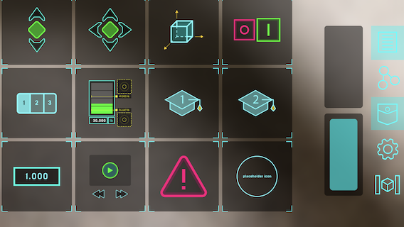

# Creating a Simple Tool

In this tutorial, you will learn how to build a tool that can be placed in space and change color
in response to other tools:


You will learn to create a **global tool**, which means this frame will appear in your pocket so
you can add as many of them to the scene as you want. A follow-up tutorial will show you how to
create this as a **local tool** instead.

### Setting up a new addon

The tools that appear in your pocket come from the addons of any edge servers in your network
(including the one on the phone). So to create a new tool, lets create a new addon to hold your
experiments. If you already have an addon, feel free to add this to that one.

First, navigate to your `vuforia-spatial-edge-server/addons` directory. If you don't already have
a Vuforia Spatial Edge Server installed, refer to the installation instructions
[here](https://github.com/ptcrealitylab/vuforia-spatial-toolbox-documentation/blob/master/startSystem/startSystem.md)
before you continue.

In that directory, you will likely see the `vuforia-spatial-core-addon`, but rather than add our
new tool to the core-addon, create a new directory next to it called `my-addon`. Inside `my
-addon`, create a new directory called `tools`. This will hold all of the new tools you develop
that will get added to this edge server.

#### Create the index.html file

and then within that create a directory with the name of the tool you want to create, which in
this case will be called `randomColor`. Finally, inside that directory create a new HTML file
called `index.html`. The resulting path of that file should be `vuforia-spatial-core-addon
/addons/my-addon/tools/randomColor/index.html`.

The resulting directories should look like:


Edit the index.html file and replace its contents with the following. I'll explain each comment
(1–4) afterwards.

```html
<!DOCTYPE html>
<html lang="en">
<head>
    <!-- 1. these libraries will be injected by the Edge Server -->
    <script src="objectDefaultFiles/object.js"></script>
    <script src="objectDefaultFiles/pep.min.js"></script>

    <meta charset="UTF-8">
    <title>randomColor</title>
    <style>
        /* Fill the page with a circle */
        #container {
            /* (290 + border) will fit inside body size */
            width: 290px;
            height: 290px;
            border: 5px solid black;
            border-radius: 50%;
        }
    </style>
</head>

<!-- 2. Set the width and height of your tool here -->
<body style="width: 300px; height: 300px">
<div id="container"></div>

<script>
    // 3. Try to load the RealityInterface APIs.
    let realityInterface = new RealityInterface();

    // 4. When we tap on the container, change the color
    let container = document.getElementById('container');
    container.addEventListener('pointerup', function() {
        let newHue = Math.round(Math.random() * 255);
        setColor(newHue);
    });

    function setColor(hue) {
        container.style.backgroundColor = 'hsl(' + hue + ', 90%, 70%)';
    }
</script>
</body>
</html>
```

1. The `object.js` file contains all of the APIs that let this HTML page function in AR in the
   Vuforia Spatial Toolbox app. When the server loads this tool as an addon, it will inject that
   script at the path `objectDefaultFiles/object.js`.  (The second script, pep.min.js, lets us use
   pointer events even if the app is running an old browser version).
2. The width and height of the body will define the size of the tool. Any HTML contents outside
   of the width and height will be cropped.
3. Because we have included the `object.js` script, we can access the APIs it provides by
   creating a new RealityInterface instance. We aren't using it for anything yet (we will by the
   end of this tutorial), but you should instantiate it anyways so that the tool properly loads.
4. Here we can add any behavior to this frame, as if it were an ordinary HTML page. We add a
   pointerup event so that if the user taps on the tool, it will pick a random color and change its
   background to that. Note that we have to use pointerevents (pointerup, pointerdown, pointermove,
   and pointercancel) – regular mouse or click events won't work.

#### Create the icon.gif file

You then have to give your frame an icon image, which is what it will look like in the pocket.
For now, use this placeholder image:


Place it in the same directory as the index.html file. Make sure it is named icon.gif.

If you run your app now, and your server has at least one world object in the space, you should
see this icon in your pocket:



If your server doesn't have a world object yet, you won't see this icon in your pocket, so
*follow these instructions to create one*. Why does it need a world object? This global tool
that you built only exists on this edge server, so it only knows how to "stick" to objects on
this edge server. Creating a world object on this server sort of "blankets" your space with an
invisible object that your custom tools will know how to attach to.

If you tap on the placeholder icon in the pocket, it will add an instance of your tool to the
scene. Tapping on it will randomly change its color. You can add as many of these to your scene
as you want.


#### Make it programmable

Right now, if you switch to programming mode in the app, you won't be able to link this tool to
any other tools, because we haven't created a **node** for the tool in the index.html file. Let's
change that.

Replace the contents of index.html with the following. I'll explain each new comment (5–7)
afterwards.

```html
<!DOCTYPE html>
<html lang="en">
<head>
    <!-- 1. these libraries will be injected by the Edge Server -->
    <script src="objectDefaultFiles/object.js"></script>
    <script src="objectDefaultFiles/pep.min.js"></script>

    <meta charset="UTF-8">
    <title>randomColor</title>
    <style>
        /* Fill the page with a circle */
        #container {
            /* (290 + border) will fit inside body size */
            width: 290px;
            height: 290px;
            border: 5px solid black;
            border-radius: 50%;
        }
    </style>
</head>

<!-- 2. Set the width and height of your tool here -->
<body style="width: 300px; height: 300px">
<div id="container"></div>

<script>
    // 3. Try to load the RealityInterface APIs.
    let realityInterface = new RealityInterface();

    // 5. This attaches a programmable node to your tool
    realityInterface.initNode('hue', 'node', 0, 0);

    // 6. Whenever data arrives at the node, update the color of this tool
    realityInterface.addReadListener('hue', function(event) {
        let newHue = Math.round(event.value * 255);
        setColor(newHue);
    });

    // 4. When we tap on the container, change the color
    let container = document.getElementById('container');
    container.addEventListener('pointerup', function() {
        let newHue = Math.round(Math.random() * 255);
        setColor(newHue);

        // 7. Whenever we tap, emit the new hue from the node
        realityInterface.write('hue', newHue/255);
    });

    function setColor(hue) {
        container.style.backgroundColor = 'hsl(' + hue + ', 90%, 70%)';
    }
</script>
</body>
</html>
```

5. As soon as the tool loads, we initialize a new programming node that will be attached to the
   tool. Its name will be "hue" (to represent the color of the tool), and it will be a default node
   type ("node"). It will be positioned at the center of the tool (x=0, y=0).
6. This is how we can listen to data being sent to this node from another node in the system. The
   `event.value` will be the data sent to it, in the form of a number between 0 and 1. We need to
   scale that up to the range \[0,255]  because the setColor function expects a value in that
   range.
   Whenever another node sends data to the hue node, this will trigger and update the color.
7. This is how we can output data from the hue node and send it to other nodes that this links to.
   We need to scale the newHue down by a factor of 255, because it is currently in the range of
   \[0,255] but all data sent across links should be in the range \[0,1]. In this way, when we
   tap on the tool, in addition to setting its color randomly, it will also output a random
   value from its node.

If you save this file and reopen your Vuforia Spatial Toolbox app, you will have an updated
version of the randomColor tool in you pocket. You can now link other tools to its node to set
its color programmatically, e.g:


You can also tap on the node to output a value, e.g:


#### Conclusion

In this tutorial, you have learned the following:

1. How to create an addon for your edge server to contain a custom-built global tool.
2. How to set up a starter-template for a tool, with an icon and a simple HTML page.
3. How to use the Toolbox APIs to add a node to your tool, and read and write data to that node.

At this point, you can try to add more functionality to this tool, or create an entirely new tool
with whatever UI you can think of. Some ideas:

- Add more nodes to this tool to control the saturation and lightness of the color, in addition
  to the hue.
- Instead of choosing the color randomly, set it based on (x,y) position of your pointerevent, or
  build a menu outside the circle that lets you select between a few chosen colors.
