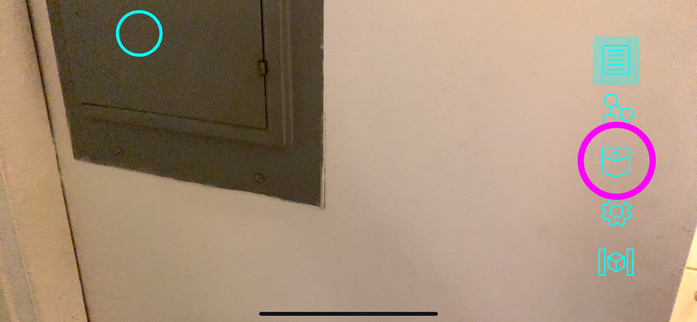
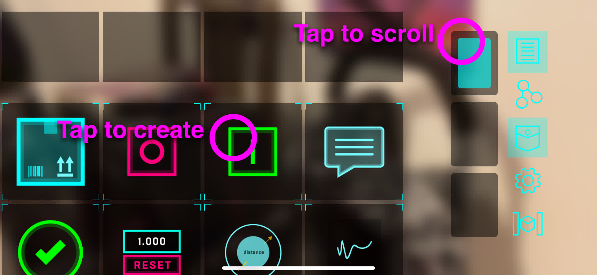
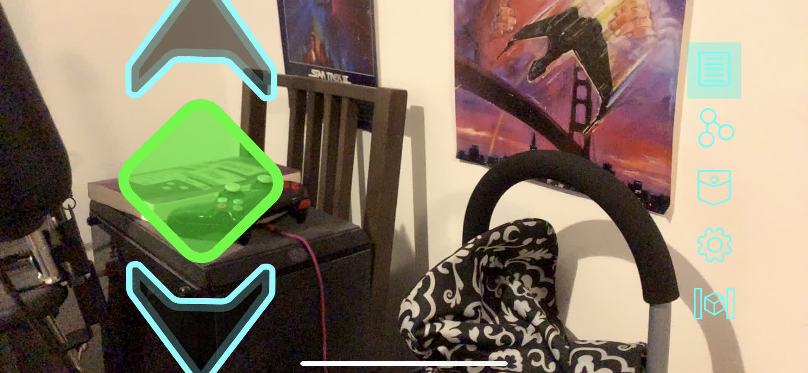
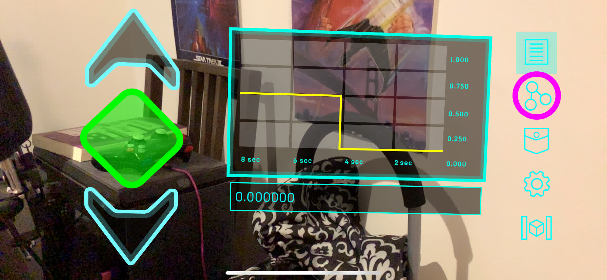
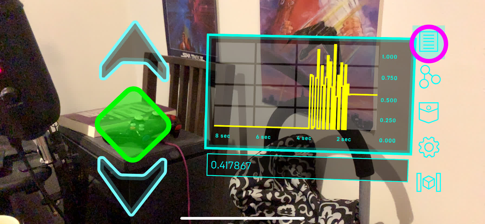

## Install Edge Server

If you are an experienced Node.js developer and want to get started
immediately, follow the instructions under "Quick Start for Developers."
Otherwise, scroll onwards to find more in-depth documentation for your platform
of choice.

### Quick Start for Developers

```bash
# Clone the edge server
git clone https://github.com/ptcrealitylab/vuforia-spatial-edge-server/

# Clone the core add-on
mkdir addons
cd addons
git clone https://github.com/ptcrealitylab/vuforia-spatial-core-addon/

# Install the dependencies in core-addon and server
cd addons/vuforia-spatial-core-addon; npm install
cd ../../; npm install

# Run
node server.js
```

### Mac

Follow [the platform specific install instructions](./startSystem-mac.md)

### Windows

An in-depth walkthrough is coming soon. The Mac instructions are mostly applicable if you want to use
GitHub Desktop and Powershell. Alternatively, check out the quick start for
developers above.

### Linux

An in-depth walkthrough is coming soon. Until then, you can follow the quick
start for developers above in your terminal of choice.

## Install Mobile Phone App

### iOS App Store

Right now the easiest option is to email `vheun` at `ptc` dot `com` for access
to our Testflight beta. You could also compile the app from source using [the
instructions on the iOS App's
repo](https://github.com/ptcrealitylab/vuforia-spatial-toolbox-ios/).

### Google Play Store

Coming soon!

## World Objects

Now that you have the app installed you can play around with placing tools in
your local space. Look at an open space and press the pocket button to view a
palette containing all available tools. From here you can press on a tool and
drag it into your space.





Try using these steps to drag in a slider and a graph. Next, you can switch to
programming view by pressing the programming view button. In this view, you can
see nodes that represent the values of each tool or object in sight. Draw a
line from the slider's node to the graph to see the slider values over time.
Switch back to the normal view by pressing the normal view button. Now when you
move the slider it's reflected on the graph.





## Create new Object

Up until now we've been placing tools into the world without interacting with
any physical objects within the world. We want to be able to place tools in
relation to actual objects in the space and eventually use hardware interfaces
to expose each object's inner workings.

Visit http://localhost:8080 and follow the tutorial instructions to create a
local object.

### Vuforia Target

The easiest option right now is to upload an image. If you instead want to
upload a type of Vuforia Target with more customization that is better suited
to your object, you can create one in the Vuforia Developer Portal. Simply
download a normal (non-Unity) zip of your target library, making sure to use
the name provided by your local server.

### Interfaces

#### Kepware

