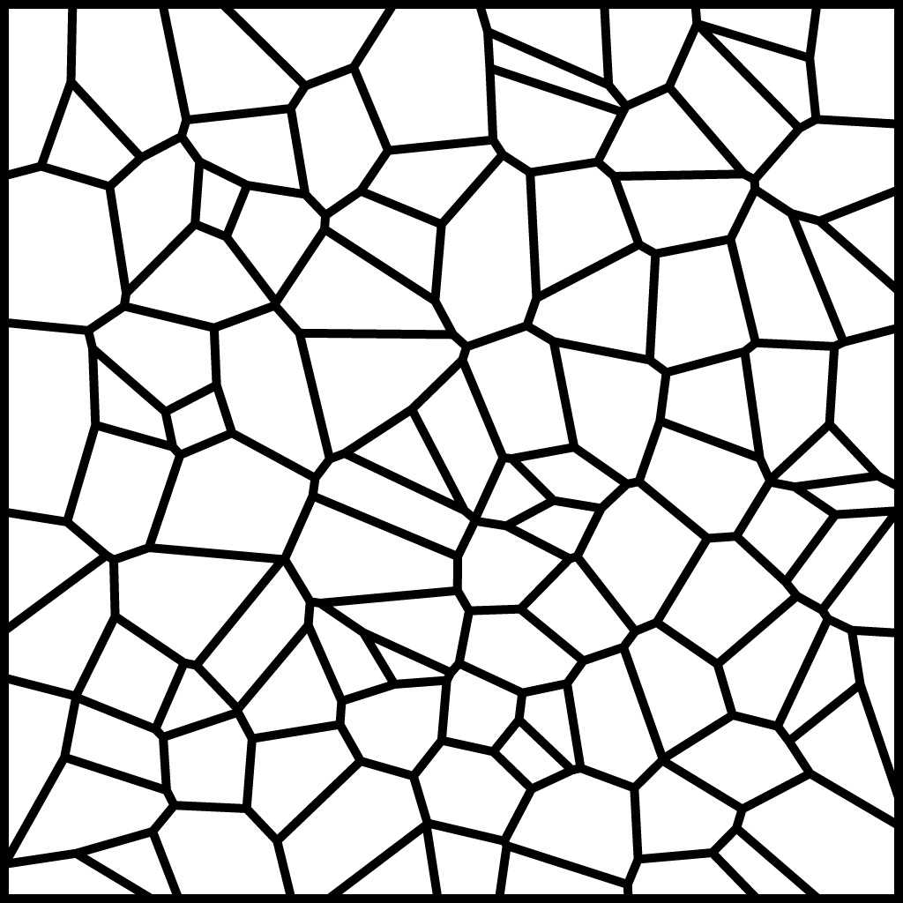

## Intermediate Tool Tutorial: 3D Graphics with A-Frame

Pre-reqs: [Creating a Simple Tool](../develop/spatial-tools/tutorial) and
[How to Create an Object](../use/connect-to-the-physical-world/create-object)

In this tutorial we'll take a basic a-frame scene and turn it into a spatial
tool with a couple minor modifications. [A-Frame](https://aframe.io/) is a
framework that allows us to write simple HTML to generate 3D scenes.


<video controls width="640">
    <source src="images/aframe-tool/aframe-demo.mov"
            type="video/mov">

    <source src="images/aframe-tool/aframe-demo.webm"
            type="video/webm">

    Sorry, your browser doesn't support embedded videos.
</video>

Whereas in some other tutorials we've created **global** tools in a new add-on,
which get added to the pocket in the app, we'll create this tool as a
**custom** tool attached to a specific object, as shown at the end of the [How
to Create an Object](../use/connect-to-the-physical-world/create-object)
tutorial. Follow that tutorial to create a new object, attach an image target
to it, and add a tool to it using the web interface. The tool will default to
looking like a blue square.

You can either follow along or
[download the completed object](https://github.com/ptcrealitylab/vuforia-spatial-toolbox-documentation/raw/master/tutorials/downloads/aframeTestObject.zip)
and unzip it into your `spatialTools` directory. Restart your server and app
and the new object should appear when you look at this image:



Let's look at the final code line-by-line to see what's going on. If you didn't
download the zip of the finished product and are instead building this from
scratch, find your object in your `spatialTools` directory, and locate the
`index.html` file for the custom tool you just added. Replace the contents with
the following code.

```html
<!DOCTYPE html>
<html>
  <head>
    <title>A-Frame Spatial Toolbox Example</title>
    <meta charset="utf-8">
    <meta name="viewport" content="width=device-width, user-scalable=no, minimum-scale=1.0, maximum-scale=1.0">
    <script src="https://cdnjs.cloudflare.com/ajax/libs/aframe/0.7.1/aframe.min.js"></script>
    <script src="https://hobinjk-ptc.github.io/aframe-tool-example/aframeTestTool/aframe-spatial-tool-component.js"></script>
  </head>
```

Here we set up the document, including A-Frame and the Vuforia Spatial
Toolbox's custom A-Frame spatial tool component.

```html
  <body>
    <a-scene vr-mode-ui="enabled: false" spatial-tool>
```

Next, we create the `<a-scene>` making sure to disable VR mode and mark it as a
spatial tool using the attribute `spatial-tool`.

```html
      <a-entity id="container">
```

We add a container for all of our content that the Spatial Tool will reposition
to align with the visual marker.

```html
        <a-entity rotation="90 0 0">
          <a-box position="-20 10 0" rotation="0 45 0" scale="20 20 20" color="#4CC3D9"></a-box>
          <a-sphere position="0 25 -40" radius="25" color="#EF2D5E"></a-sphere>
          <a-cylinder position="20 15 0" radius="10" height="30" color="#FFC65D"></a-cylinder>
          <a-plane position="0 0 -20" rotation="-90 0 0" width="80" height="80" color="#7BC8A4"></a-plane>
        </a-entity>
      </a-entity>
```

Now we add all of our 3D content. Since this example is based on the A-Frame
start scene, we've rotated all of it by 90 degrees so that it appears to be
sitting on the marker instead of being contained within it.

```html
      <a-entity id="camera-rig"
        position="0 -60 60"
        rotation="60 0 0">
        <a-camera id="camera" fov="70" near="1" far="1000"
          look-controls-enabled="false"
          wasd-controls-enabled="false"
          ></a-camera>
      </a-entity>
    </a-scene>
  </body>
</html>
```

Finally, we add the camera. The camera rig element is an optional addition used
to provide a default view for this tool. We need to make sure to disable look
and wasd controls on the camera so that the spatial tool component can have
complete control.

If you make note of the differences between this scene and the [A-Frame starter
scene](https://aframe.io/examples/showcase/helloworld/) you should be able to
convert just about any A-Frame example into a Spatial Tool.

Did you get this working? Are you looking for next steps? Share your progress
and ideas on the [forum](https://forum.spatialtoolbox.vuforia.com)!
