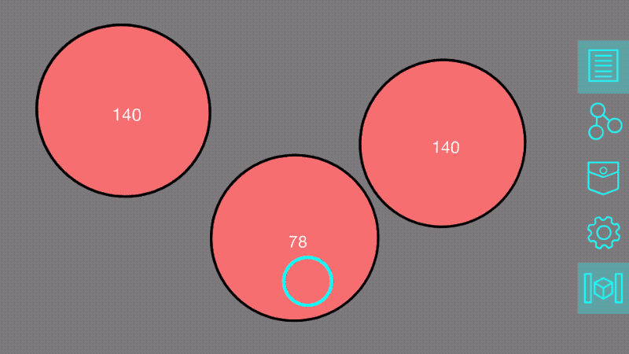

## Intermediate Tool Tutorial: Context-dependent Tools

Pre-req: [Creating a Simple Tool](../develop/spatial-tools/tutorial)

Now that you know how to create a tool and interact with some basic RealityInterface APIs,
we're going to explore some more interesting things you can do with tools. This tutorial gets a
bit complicated, but as always please [use the forum](https://forum.spatialtoolbox.vuforia.com) if
you have any questions.

##### Setting Up

First up, create a new directory in your edge server's  `addons/my-addon/tools` called
`contextDependent`. This will sit alongside the `randomColor` directory from the previous
tutorial. Copy-and-paste the same [icon.gif file](./images/icon.gif) as last time, and create an
empty index.html file. The resulting directory tree will look like:


You'll need to enable this tool on the server frontend for it to become available to clients in
the network. Go to the Spatial Tools view on localhost:8080 and click the On/Off button for the
"contextDependent" tool so that it says **On**. It should appear in the pocket of your app if
you're in the same network now, although you'll need to add some content to it first.

In this tutorial, we'll look at a couple different ways that the contents of the tool can react
to its spatial context.

### Reacting to the position of the viewer

One way that a tool can be spatially context-dependent is by responding to the relative location
between it and its viewer – you!

There are a few APIs that let a tool's contents react to its position. The most powerful one,
which lets us extract all possible information about its relative location to the camera, is
`addMatrixListener`. This is how a tool can subscribe to its **modelView matrix**. Don't panic
– you don't need to know much about this matrix (or matrices in general). Just know that this
is an array of 16 numbers (representing a 4x4 matrix of numbers) that fully describes where
the tool is positioned in 3D space, relative to the camera. You can extract the scale of the
tool from its first entry (`modelView[0]`), and the approximate distance to the camera from
its 15th entry (`modelView[14]`).

##### Demo 1: Adjust a continuous property based on distance

In this first example, we continuously adjust the color of the tool as you move from about 0.5
meters away from the tool to about 1 meter away from the tool:

```javascript
realityInterface.addMatrixListener(function(modelView, _projection) {
    // convert the scary matrix into easy-to-use values
    let scaleFactor = Math.abs(modelView[0]);
    let zDistance = Math.abs(modelView[14]);

    // choose minimum and maximum distances that it should adjust when you move between
    // consider it "close" when we're about 0.5 meters away, but increases with tool's scale
    let closeDistance = 500 * scaleFactor; 
    // consider it "far" when we're about 1 meter away, but increases with tool's scale
    let farDistance = 1000 * scaleFactor;

    // 0 if close, 1 if far, and scales linearly between the two
    // this is a "linear interpolation" formula
    let percentage = Math.max(0, Math.min(1, (zDistance - closeDistance) / (farDistance - closeDistance)));

    // change color based on how far away we are
    let newHue = Math.round(percentage * 255);
    setColor(newHue);
});
```

I used the HTML file from the previous tutorial as a starting point, and replaced its method for
changing colors with this matrix listener:


You can view and download the full index.html file for Demo 1
[on GitHub](https://gist.github.com/benptc/1b7c1d082c543d29256948eaedc9bf37).

##### Demo 2: Using distance as a threshold

In this second example, instead of continuously fading from one to another, we adjust the UI when
we cross the "close" threshold. This is a nice way to hide details when you get far away from
something, and show them again when you get closer.

```javascript
realityInterface.addMatrixListener(function(modelView, _projection) {
    let scaleFactor = Math.abs(modelView[0]);
    let zDistance = Math.abs(modelView[14]);

    let closeDistance = 500 * scaleFactor;

    if (zDistance < closeDistance) {
        document.getElementById('details').style.visibility = '';
    } else {
        document.getElementById('details').style.visibility = 'hidden';
    }
});
```

I modified the HTML from the previous tutorial again, putting a "details" div inside its
container with some default text that can be made visible or hidden. You can see the result,
as we move the camera closer to the tool, and then further:


Because we set the threshold to `500 * scaleFactor` , not just 500, scaling the tool up with a
pinch gesture will also make the details show up. If you don't want this behavior, you can leave
out the scaleFactor.


You can view and download the full index.html file for Demo 2
[on GitHub](https://gist.github.com/benptc/f03c905e52f49322dd05e49780001cde).

### Reacting to the position of another tool

A very interesting aspect of spatial computing is to make tools that are aware of which other
tools are near them, and the relative location of those tools.

A few examples of things you can do with this:

- When two tools cross a threshold of being "close" to one another, you can make their contents
  interact. For example, AR user interfaces for food packaging might show nutrition information by
  default, but when two of them get close together they could switch to a comparison mode to show
  differences in their nutrition info.
- Continuously adjust the properties of one tool based on how close some other tools are to it.
  For example, you could have a "color density" tool, which is colorless by default, but gets
  more and more colorful based on how closely other tools have been placed near it.
- Draw navigation arrows that point from one tool to another. If one tool knows where the other
  is in space, it can point an arrow towards the next tool it wants you to look at.

The process of determining which tools are around you and how close they are to one another is a
bit more difficult than just reacting to the position of the viewer. It involves a few steps.

1. Each tool needs to determine where it is.
2. Each tool needs to send that location information to any other tools that might need that
   information.
3. Each tool needs to listen for this location information being sent from other tools, and
   process it to determine the relative location between the two.

##### Demo 3: Measure the distance between tools

We'll walk through steps 1, 2 and 3 (outlined above) to build a demo that measures the distance
between itself and another tool of the same type.

1. **Each tool needs to determine where it is.**

To figure out where a tool is relative to the camera, we could use the same API as in the
previous example (`addMatrixListener`), and get the X, Y, and Z position of the tool by using:

```javascript
let position = {
    x: modelView[12],
    y: modelView[13],
    z: modelView[14]
}
```

There's another way to get it, if you prefer not to use matrices at all, using the `getPositionX`,
`getPositionY`, and `getPositionZ` APIs, although you'll have to set up your own loop. Let's use
this method, so that we explore more of the APIs:

```javascript
let thisToolPosition = { x: 0, y: 0, z: 0 }; // placeholder value

// this subscribes the API to always have up-to-date position values
realityInterface.subscribeToMatrix();

// create a loop
setInterval(function() {
    thisToolPosition = {
        x: realityInterface.getPositionX(),
        y: realityInterface.getPositionY(),
        z: realityInterface.getPositionZ()
    };
}, 100); // update 10 times per second (you can change this for smoother results)
```

2. **Each tool needs to send that location information to any other tools that might need that
   information.**

While creating complex messaging channels between tools is possible, an easier way to achieve a
similar result is to use the `sendGlobalMessage` and `addGlobalMessageListener` APIs. *(Don't
use this if you're sending sensitive information between tools, because all tools currently
visible in the scene will be able to listen in. But for something like position data it'll
work just fine.)*

If you update your loop with the following contents, it'll broadcast this tool's position
relative to the camera 10 times per second to all visible tools. You can also include whatever
additional data you want in this packet. I added a property called `messageType` so that we can
identify these messages in the next step.

```javascript
setInterval(function() {
    thisToolPosition = {
        x: realityInterface.getPositionX(),
        y: realityInterface.getPositionY(),
        z: realityInterface.getPositionZ()
    };
    let messageToSend = {
        messageType: 'contextDependentDemo',
        position: thisToolPosition
    };
    // make sure to stringify the message
    realityInterface.sendGlobalMessage(JSON.stringify(messageToSend));
}, 100);
```

3. **Each tool needs to listen for this location information being sent from other tools, and
   process it to determine the relative location between the two.**

The last step is to subscribe to these global message broadcasts, and compare a tool's own
position with the positions of other tools it hears about.

`addGlobalMessageListener` will get triggered anytime another tool in the scene uses
`sendGlobalMessage` . Extract the position data from messages with the type of
"contextDependentDemo", and do a bit of vector math to compute the distance between the two tools.

```javascript
// listen for every global message broadcasted in this scene
realityInterface.addGlobalMessageListener(function(messageString) {
    try {
        let message = JSON.parse(messageString);
        // ignore all messages except the 'contextDependentDemo' ones
        if (typeof message.messageType !== 'undefined' &&
            message.messageType === 'contextDependentDemo') {
            receivedToolPosition(message.position);
        }
    } catch(err) {
        console.warn('error parsing global message', err);
    }
});

function receivedToolPosition(otherToolPosition) {
    // find vector between own position and other position
    let diff = {
        x: otherToolPosition.x - thisToolPosition.x,
        y: otherToolPosition.y - thisToolPosition.y,
        z: otherToolPosition.z - thisToolPosition.z,
    };
    // distance between tools is the magnitude of this vector: sqrt(dx^2 + dy^2 + dz^2)
    let distance = Math.sqrt(diff.x * diff.x + diff.y * diff.y + diff.z * diff.z);
  
    // do something with this information. for now, just display it as a number.
    document.getElementById('details').innerText = distance;
}
```

If you test this out and add two of these tools to the world, you'll see it working! Both of them
should set their detail text to a number, which is the distance between the two tools. Pretty
cool! You could even combine this with the previous tutorial, and emit a value from the tool's
node based on how close the other tool is – making the relative locations of tools available
as an input to the spatial program.


This also works if you move around the tools in 3D space, because we're measuring the full 3D
distance between the two, not just the apparent 2D distance on the screen.


### Reacting to the positions of multiple tools

There's a problem in our current implementation if there are more than two of these tools visible
at the same time – they'll all compete to send each other their position information, and you'll
likely see the values flicker between all of the possible distance combinations.



You'll have to decide how to resolve these conflicts, but a few options include: 

1. Set the value to the average of all the distances it receives.
2. Only display the closest (or, alternatively, the furthest).
3. Display all of the distances separately instead of overwriting.

I'm going to show how to implement Method 1 here. If you're looking for a challenge, try to
implement Method 2 or 3 afterwards.

Correctly implementing any of these methods is a bit complicated, because they require
distinguishing which distance comes from which tool. To do so, each tool needs to include a
unique ID in the global message it sends, so that the receiving tool can match messages coming
from the *same* tool over time, vs those coming from multiple *different* tools.

To do this, modify the `messageToSend` variable to include a built-in constant that each tool has,
called `realityObject.frame` – this variable holds a unique ID for this tool.

```javascript
let messageToSend = {
    messageType: 'contextDependentDemo',
    senderId: realityObject.frame,
    position: thisToolPosition
};
```

Now we need to define one new variable – an object to hold the current distance to each `senderId`
– and a helper function to calculate the average of them.

```javascript
let distances = {};

// helper function to average an array of numbers
function average(numbers) {
    let sum = 0;
    for (let i = 0; i < numbers.length; i++) {
        sum += numbers[i];
    }
    return sum / numbers.length;
}
```

Next, we can update the `receivedToolPosition` function. When we call it in the global message
listener, send it the `senderId` in addition to the position:

```javascript
receivedToolPosition(message.position, message.senderId);
```

Now update `receivedToolPosition` with the following:

```javascript
function receivedToolPosition(otherToolPosition, senderId) {
    let diff = {
        x: otherToolPosition.x - thisToolPosition.x,
        y: otherToolPosition.y - thisToolPosition.y,
        z: otherToolPosition.z - thisToolPosition.z,
    };
    let distance = Math.sqrt(diff.x * diff.x + diff.y * diff.y + diff.z * diff.z);

    // store this distance by its sender's unique ID
    distances[senderId] = distance;

    // compute the average of all the stored distances
    let averageDistance = average(Object.values(distances));

    // display the average of all distances
    document.getElementById('details').innerText = Math.round(averageDistance);
}
```

Now open your app and try to add three or more tools to the space – it should work!


You can view and download the full index.html file for Demo 3
[on GitHub](https://gist.github.com/benptc/c2d12cba69ea8b26a9c60b50adc2a19c).

### What's Next?

I hope this inspired you with some new ideas of how you can leverage the Spatial Toolbox APIs to
create spatially context-dependent tools. The previous tutorial showed you how to create
programmable tools, but this extends it by making the relative position of the viewer and other
tools into parameters that you can work with. Combine the two, and you may come up with a
completely novel spatial interaction!

Experiment with the tool from this tutorial and try to make it more interesting. Instead of just
writing the average distance as a number, can you make it affect the color or size of the
graphics? What about writing the average distance to a node, so that you can link it to other
tools? Can you figure out how to implement Method 2 and/or 3 that I suggested in the section
about resolving conflicting values from multiple tools? Please share your creations in the
[forum](https://forum.spatialtoolbox.vuforia.com).

As a recap, we worked with the following APIs in the previous tutorial:

- initNode
- addReadListener
- write

And in this tutorial, we learned how to use:

- addMatrixListener
- subscribeToMatrix
- getPositionX
- getPositionY
- getPositionZ
- sendGlobalMessage
- addGlobalMessageListener

For even more APIs, check out the full [reference page](../develop/spatial-tools/api-reference).
