## Attaching Targets to your Objects

Vuforia Spatial Toolbox currently supports the following types of targets to be associated with
your objects:

- **Instant Image Targets** *(recommended for beginners)*
    - Generate at runtime using a JPG image and the Spatial Edge Server dashboard.
- **Image Targets**
    - Generate using a JPG image and the [Vuforia Developer Portal](https://developer.vuforia.com).
- **Object Targets**
    - Generate using a scan from the
      [Vuforia Object Scanner app](https://library.vuforia.com/articles/Training/Vuforia-Object-Scanner-Users-Guide)
      and the Vuforia Developer Portal.
- **Area Targets**
    - Generate using a Matterport camera and the Vuforia
      [Area Target Generator](https://library.vuforia.com/content/vuforia-library/en/features/environments/area-targets/area-targets-generator-user-guide.html).

Other target types, such as Model Targets (generated from CAD data), are not yet supported.

Instant Image Targets are the only target type that you can generate instantly using nothing but
the Vuforia Spatial Edge Server. All other target types require additional setup steps, but
may result in higher quality tracking experiences.

### Instant Image Targets

The first method, which is good for quick prototyping, is just to upload a JPG image to the
object on the Spatial Edge Server. This uses Vuforia Engine's **Instant Image Target** feature
to generate a trackable AR target from a single image at runtime.

To fully learn how to add an instant image target, see the detailed example in the
[How to Create an Object](../use/connect-to-the-physical-world/create-object) tutorial. To
summarize, all you need to do is drag-and-drop an image file onto the Drop Zone of your object on
the Spatial Edge Server's web interface.

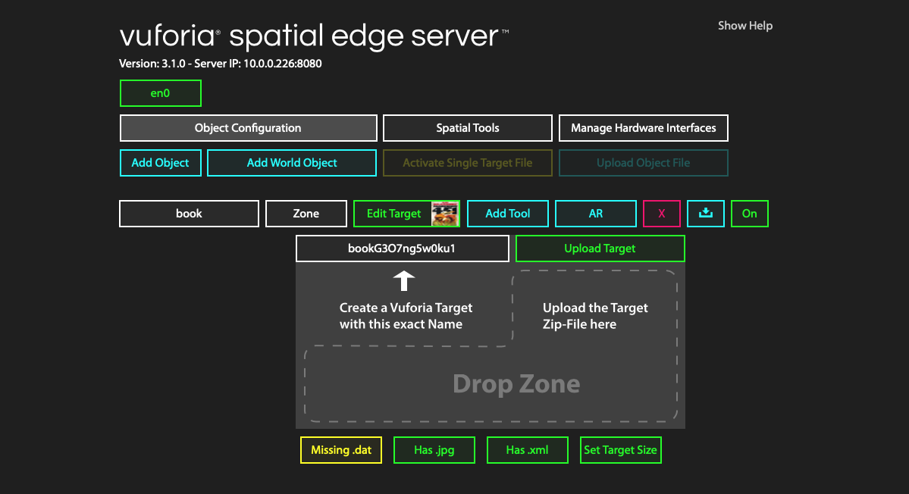

**Pros:**

- Very quick and easy to set up.
- Lets you instantly start adding AR content to something based on an image of it.

**Cons:**

- As of this version of the Spatial Toolbox, the tracking isn't as high quality as with the other
  methods, and there is no feedback about how well the image you upload will perform.
- You're also limited to using Image Targets, rather than targets based on 3D scans, so the type
  of physical things that you can augment is limited to flat things with lots of visual detail.

### Image Targets on the Vuforia Developer Portal

The other methods take a bit more time to configure, but result in higher quality tracking and a
wider range of target options. You'll need to sign up for a free developer account on the
[Vuforia Engine Developer Portal](https://developer.vuforia.com). This portal allows you to
generate high-quality targets from an image or a scanned 3D object.

The Vuforia Developer Portal has a page called the Target Manager, that lets you upload data of a
few different formats (JPG, PNG, OD) and convert them into DAT and XML files that store the
trackable dataset and its metadata. These dataset files generated by the developer portal can
then be uploaded to the Spatial Edge Server to attach that target dataset to a Spatial
Toolbox object.

First, go to https://developer.vuforia.com and click on the "Develop" menu item. It will prompt
you to log in before you can configure anything.

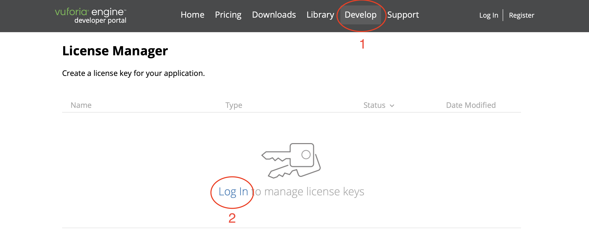

If you already have an account, log in. Otherwise, follow the prompts to create an account. 

Now when you go to the "Develop" menu item you'll be on the "License Manager" page. Click instead
on the "Target Manager" button in the green sub-menu to switch to the page where all of the
target creation will take place.

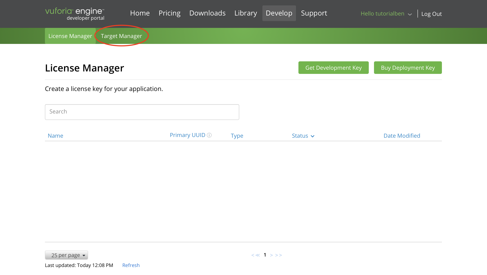

You'll now see the empty Target Manager page. This lets you create "databases" of targets.
Vuforia Spatial Toolbox doesn't care about how targets are organized into databases – as you'll
see later, we just create and download a single target at a time. But you need to create at
least one database to store your targets in. You might decide to create multiple databases in
the future to organize your targets. For now, click on "Add Database".

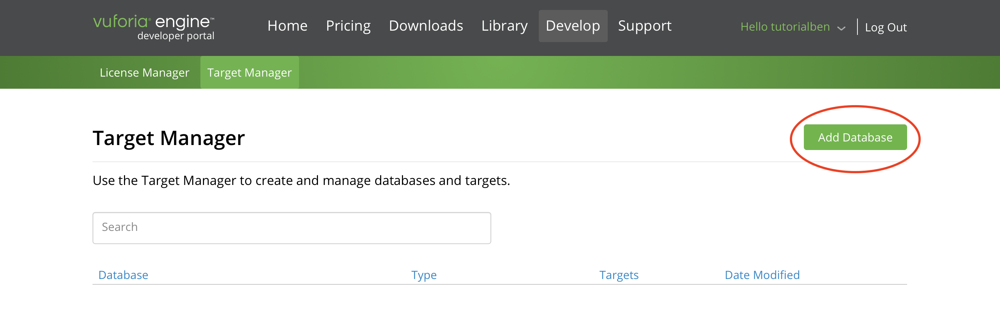

The name of your database doesn't matter, but use something relevant to the content, such as
"tutorials". Click "Create" to continue.

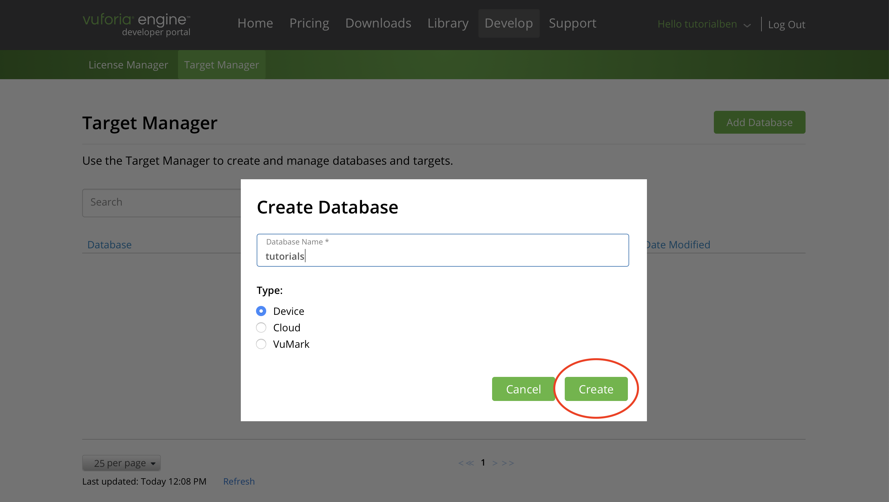

Now you'll see your database in the list. Click on its name to open it up.

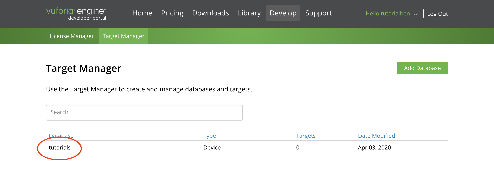

Now click on "Add Target" to create a target.

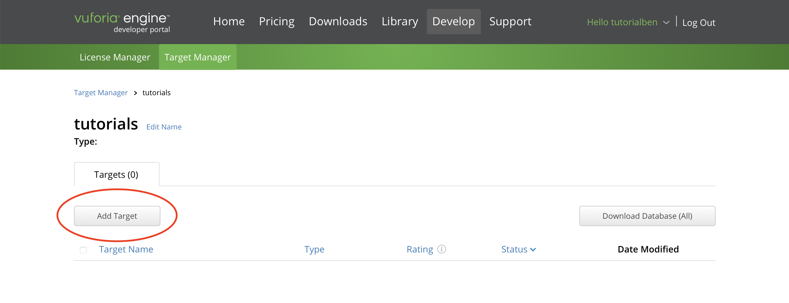

You'll see a dialogue pop up where you can configure this target. This is the important step. By
default, "type" will be set to "Single Image". This is what you want to use if you want a higher
quality image target.

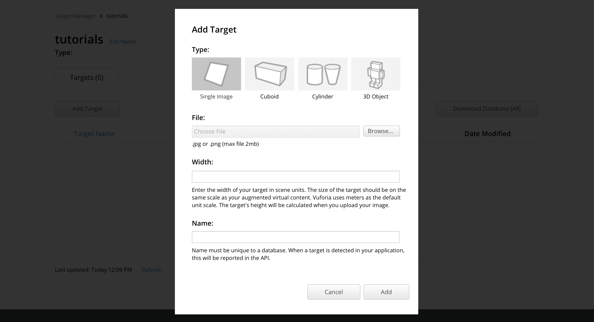

You can upload the same JPG image that you would drag-and-drop onto the Edge Server's Drop Zone
if you were creating an Instant Image Target, but this time it will get processed and compiled
into a dataset ahead of time, rather than processing the image at runtime. Click browse and
select an image for your target. **Don't click "Add" yet.**

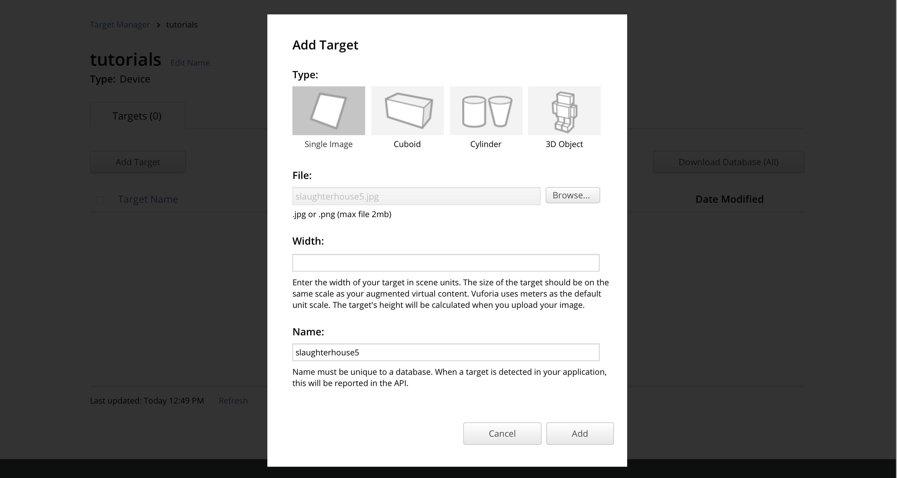

There's **one important detail** that you need to get right at this step in order for your image
target to correctly associate with your Spatial Toolbox object. The **name** will default to the
name of the image you upload, but you must change it to **exactly match** the **unique ID** of
your Spatial Toolbox object. This is different from your object's name – it is the object name
with an additional set of characters at the end. To see it, go to the web interface of the
Spatial Edge Server in a different tab or window, and click on "Add Target" (or "Edit Target").

I created a new object called "otherBook" to demonstrate. After clicking on "Add Target" to view
the Drop Zone, the unique ID shows up. In this case it is "otherBook4Oagatuej8ah" but it will be
a different random ID for you. 

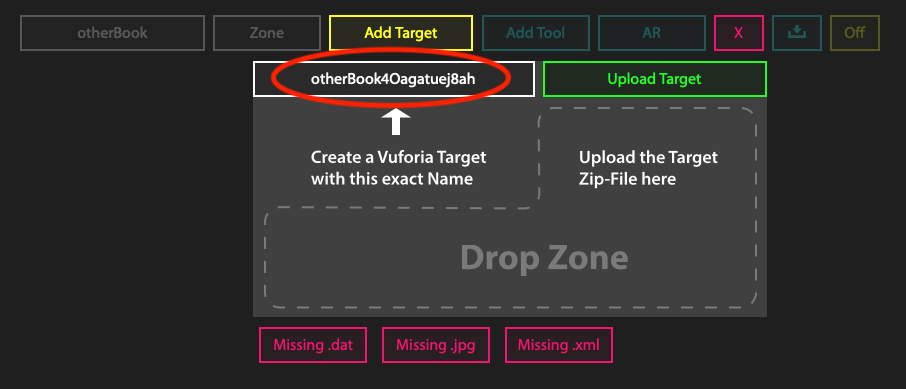

Copy-and-paste that ID from the Spatial Edge Server to the "Name" field of the target manager on
the developer portal. The last step is to specify the size of your target. This is the
approximate width (in meters) of your object. Getting this exactly correct isn't necessary for
most use cases of the Spatial Toolbox, but some features may perform poorly if the size is off
by a large degree. 0.3 meters (about 1 foot) is a good default value if you can't measure
your object exactly, which performs well if the image is roughly the size of A4 printer
paper or viewed fullscreen on an average laptop.

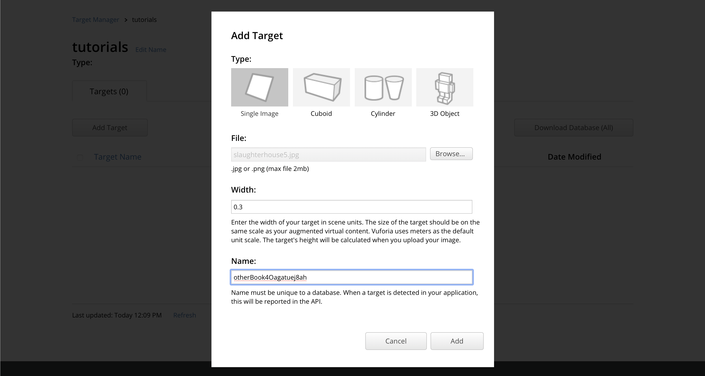

Now click "Add" and the page will indicate that the target image is being processed.

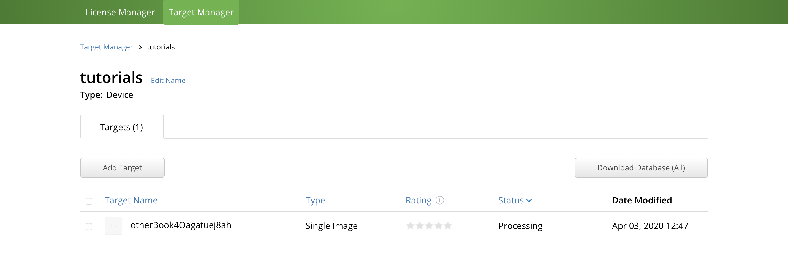

This usually takes only a few seconds. Refresh the page to see the result.

The "Rating" column will show you how good of a target image this is. Good images should be rich
in detail, have a lot of contrast, and not just be an identical repeating pattern, as described
in great detail the [Developer Library](https://library.vuforia.com/articles/Solution/Optimizing-Target-Detection-and-Tracking-Stability#attributes).
If your target's rating is less than 4 or 5 stars you should choose something else, take a clearer
photo, or edit the image following the recommendations in that article. 

To see exactly how your image is being used for tracking, you can click on the name of the target
on this screen to view its details, and then click on the "Show/Hide Features" button below the
image.

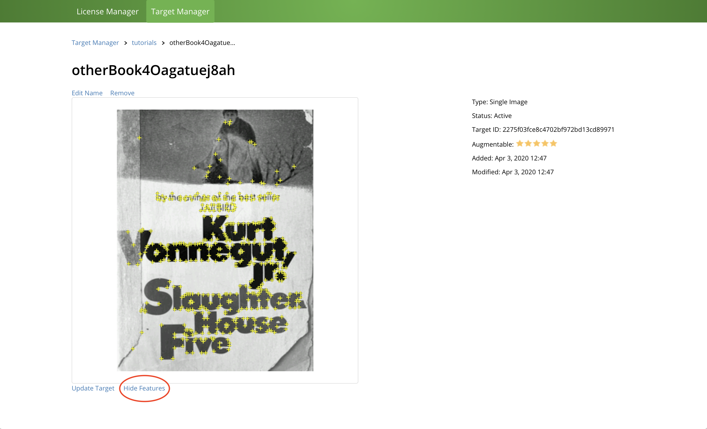

Each yellow crosshair represents a feature point that the tracker can use to identify this image
compared to everything else it sees in the camera. Notice that they appear on the corners of
high-contrast shapes. You can use this tool to test your images and choose better images in the
future.

Now it's time to download your processed dataset. Go back to your database, click the checkbox to
the left of your target name, and then click the "Download Database (1)" button in the upper
right.

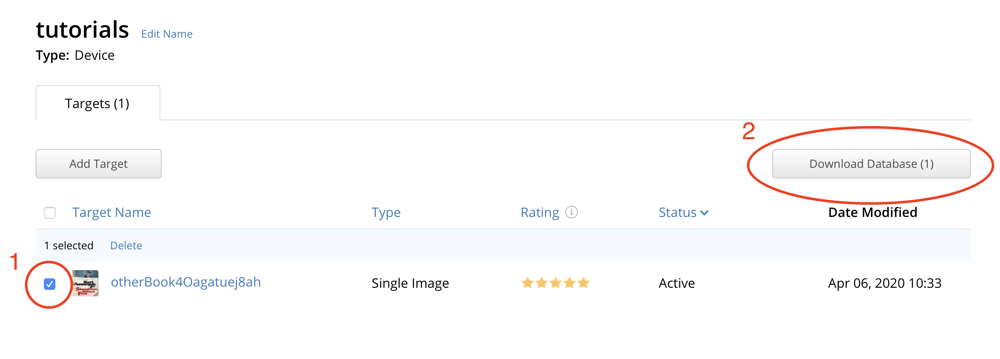

A dialog will pop up. Make sure to choose the Android/Xcode option, not the Unity option. Then
click "Download."

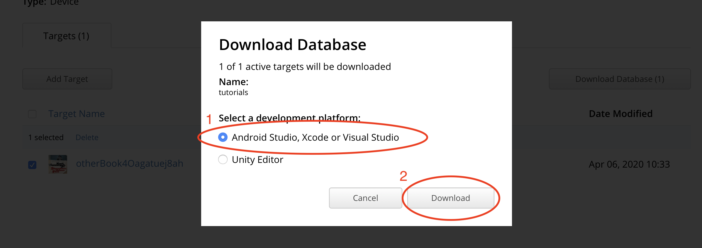

This will download a zip file. Don't unzip it – if your browser automatically unzips it for you,
you might want to temporarily disable that feature.

Go back to the Vuforia Spatial Edge Server, click on "Add Target" so that the Drop Zone appears,
and drag-and-drop the zip file onto the Drop Zone. You'll see the "Missing .dat" and "Missing.xml"
icons disappear.

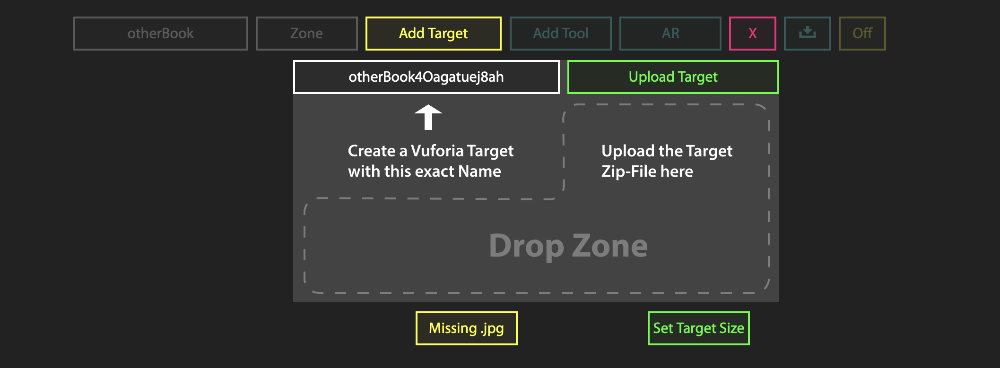

To finish initializing it, you'll also have to drop a JPG onto the drop zone, the same way as if
you were creating the target using the Instant Image Target method. This JPG gets used for the
object's icon, and as a backup target in case the dataset in the zip file fails. Once you add
the JPG, the object will turn on.

**Pros:**

- Tracking is more stable than Instant Image Targets.
- You can see a star rating of how well this image will perform.

**Cons:**

- Takes more time to set up.

### Object Targets on the Vuforia Developer Portal

One variation on the previous method is that there are multiple types of targets that you can
create through the Developer Portal. In addition to Image Targets, Vuforia Spatial Toolbox
supports Object Targets, which can be created from the
[Vuforia Object Scanner Application](https://library.vuforia.com/articles/Training/Vuforia-Object-Scanner-Users-Guide).
Object targets let you use a 3D scan of an object as your target dataset, so that it can be
recognized from multiple angles.

Using that application will generate a *.OD file (Object Data).

When the prompt is open to create a new target, click on the "3D Object" option instead of the
"Single Image" option. *(Note: Cuboid and Cylinder are not fully supported)*

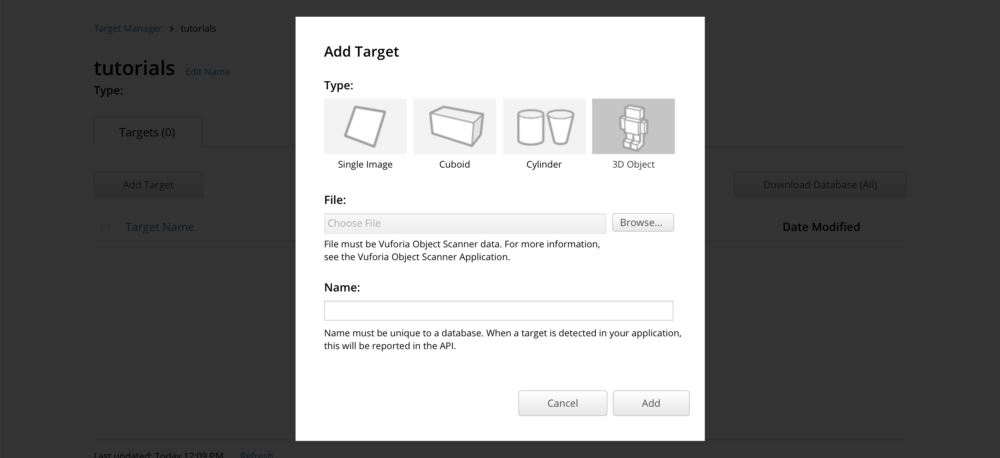

The process is very similar to creating an object with an image target.

1. Upload the OD file.
2. Name it with the exact object ID that you want to associate it with.
3. Download the zip file.
4. Upload the zip onto the Drop Zone of the object.
5. Add a JPG as an icon / backup target. *(Don't forget this step!)*

### Area Targets

[Area Targets](https://library.vuforia.com/content/vuforia-library/en/features/environments/area-targets.html)
are a new type of target in Vuforia Engine 9.0 that is recently supported by Vuforia Spatial
Toolbox. You can use this type of target to associate AR content with a 3D scan of a large space.

A brief summary of the steps involved:

1. Follow the [Area Target guide](https://library.vuforia.com/content/vuforia-library/en/features/environments/area-targets/how-to-create-area-targets.html)
   on the Vuforia Developer Library to capture a space, process it, and connect it to the Area
   Target Generator application.
2. In the Area Target Generator, when prompted to set the "Area Target Name" (before clicking
   "Create Area Target") make sure to name it with the unique ID of your Spatial Toolbox object
   (similar to creating Image and Object Targets on the Vuforia Developer Portal).
3. Download the resulting target, which will include XML, DAT, GLB, and Unity Package files.
4. Upload the XML file to the Drop Zone on the Vuforia Spatial Edge Server, and then the DAT.
5. As always, upload a JPG for your object's icon and backup target.

A more detailed guide for using Area Targets in Vuforia Spatial Toolbox will be available in the
future – for now, if you questions please ask them in the [forum](https://forum.spatialtoolbox.vuforia.com).

### Troubleshooting

When associating target data with an object, you can see what’s happening behind the scenes by
looking at your local filesystem. Your objects and their target data get stored in your
`~/Documents/spatialToolbox` directory (this will be automatically generated when you run the
Spatial Edge Server).

Inside that, there will be a directory for each of the objects you have created on the edge server
dashboard. Open up the directory with the name of the object you are trying to upload target
files to. A fully initialized object will have a directory for each custom tool you add to it, as
well as a hidden folder called `.identity`. You may have to change some settings to see this folder.

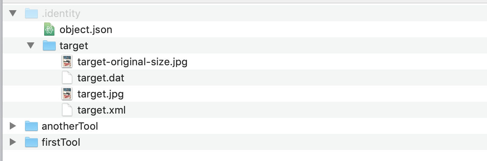

`.identity` contains metadata about the object in the `object.json` file, and should have a
`target` directory with the contents of the zip file or jpg images that you have dropped on this
object's  Drop Zone.

If you've uploaded files using the drop zone, but your object isn't initializing correctly, check
the `target` folder to ensure that at least the two following files are present:
 
- target.xml
- target.jpg

Additionally, if you are not using the Instant Image Target method, there should be:

- target.dat

If these are missing, have the incorrect names, or got unpacked into the wrong directory, you
may be able to fix it by manually moving around the files, and then restarting the server.
