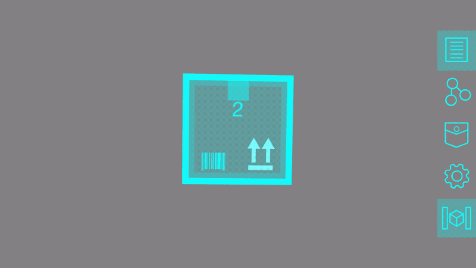

## Advanced Tool Tutorial: Envelopes (Part 1)

Welcome to another tutorial on building tools for the Vuforia Spatial Toolbox. In this tutorial, we're talking about
**Envelope** tools, and will cover:

- What an envelope is
- The difference between envelope containers and contents
- How to create a very simple envelope container
- How to create a very simple envelope contents

Part 1 of this tutorial is quite simple, but Envelopes have the potential to be complex and powerful systems, so this
tutorial is categorized as "Advanced". If you haven't yet, you should look at the beginner and intermediate tool
tutorials first.

### What is an envelope and why do they exist?

The concept of envelopes was created out of a need to combine multiple tools into different sorts of relationships
than "linking" provides. Links between tools' nodes allows them to send and receive data from one another, but what
if you want to combine a set of tools into a guided sequence? What if you want to form a group out of some tools
that will become visible or invisible based on certain conditions? What if you want to summarize the overall
status of a set of tools when you are far away, but show the tools in detail when you get close? These, and many
more use cases, are hard or impossible to accomplish with just links between nodes.

All of these features require a way to **combine and organize tools** into different groups, and some of them require
tools to become **visible or invisible** based on whether that group is in focus. These capabilities are what an
Envelope provides.

*Note: Envelopes are under active research and development, and their behavior is subject to change in the future.
The tutorial will be updated if the behavior or APIs change.*

### **The simplest envelope**

A simple envelope is included in the default set of tools. This is the simplest possible envelope. It has an icon
that you can tap on to open it up and put other tools inside it. Then you can minimize it to hide the contained
tools. More interesting demos are possible using the same APIs, but this is a good starting point.



### The structure of an envelope

An envelope is really a "system" composed of two different types of tools:

**Envelope Containers** and **Envelope Contents**

An envelope **container** is a tool like the blue square in the above example. It has two states: **open** and
**closed**. When it is closed, it just shows up as a small widget floating in 3D space (like most tools). But
tapping on it opens it up, which hides that icon and has the option to show some additional 2D graphics on the
screen (like the X button in the corner).

When an envelope container is open, and a compatible tool is dropped into the scene, the newly added tool will get
saved as one of that container's **contents**. All the envelope contents will be visible until the envelope is
closed.

An envelope container gets to choose which tools can go inside it. In the above example, the blue envelope tool has a
list of compatible contents, including the on and off buttons. But you can create custom types of envelopes that can
only contain specific tools that know how to work together.

### Example Code 1: simple-envelope-container

Explaining everything about envelopes on a conceptual level without looking at any code examples can be confusing.
Let's build some envelope tools in a new add-on to explore how they work.

Start out by creating a new add-on called `envelope-tutorial-addon` and creating a `tools` directory in it for the
tools we're about to build. If you have any trouble setting it up, refer back to the
[Creating a Simple Tool](../develop/spatial-tools/tutorial) tutorial for more detailed instructions.

Create a new tool there named `simple-envelope-container`. The resulting file path that should end up with your tool's
HTML is `vuforia-spatial-edge-server/addons/envelope-tutorial-addon/tools/simple-envelope-container/index.html`

Copy-and-paste these contents into that index.html:

```html
<!DOCTYPE html>
<html lang="en">
<head>
    <!-- 1. Import the Envelope Container APIs -->
    <script src="objectDefaultFiles/envelope.js"></script>
    <meta charset="UTF-8">
    <title>Simple Envelope Container</title>
    <style>
        body {
            font-family: "Helvetica Neue", Helvetica, Arial, sans-serif;
            width: 300px;
            height: 300px;
            font-size: 24px;
            text-align: center;
            overflow: visible;
        }
        /* semi-transparent blue fullscreen div */
        #rootElementWhenOpen {
            position: absolute;
            left: 0;
            top: 0;
            /* gets overwritten by the envelope APIs to be fullscreen but this is a default */
            width: 736px; 
            height: 414px;
            background-color: rgba(0, 255, 255, 0.3);
            color: white;
        }
        /* small cyan icon div */
        #rootElementWhenClosed {
            position: absolute;
            left: 0;
            top: 0;
            width: 300px;
            height: 300px;
            border-radius: 10px;
            background-color: rgb(0, 255, 255);
        }
    </style>
</head>
<body>
<!-- 2. Create a rootElementWhenOpen with the UI that shows when it is in fullscreen 2D mode -->
<div id="rootElementWhenOpen">Open</div>
<!-- 3. Create a rootElementWhenClosed with the UI that shows when it minimized into an icon -->
<div id="rootElementWhenClosed">Closed</div>
</body>
<script>
    let spatialInterface = new SpatialInterface();

    // 4. Define a list of the names of tools that can go inside this envelope
    let compatibleToolTypes = ['simple-envelope-contents'];

    let rootElementWhenOpen = document.getElementById('rootElementWhenOpen');
    let rootElementWhenClosed = document.getElementById('rootElementWhenClosed');

    // 5. Designate this tool as an envelope by, automatically enabling all the associated features
    let envelope = new Envelope(spatialInterface, compatibleToolTypes, rootElementWhenOpen, rootElementWhenClosed);

    // 6. Add a touch event that opens up the envelope into fullscreen mode when the icon is tapped
    rootElementWhenClosed.addEventListener('pointerup', function() {
        envelope.open();
    });
</script>
</html>

```

1. **Import the Envelope Container APIs**
``` html
<script src="objectDefaultFiles/envelope.js"></script>
```

There is a javascript file called `envelope.js` in the vuforia-spatial-edge-server that should be included to get all
the APIs related to envelopes. Import it with this exact path so that the server can properly inject the script into
your tool when it runs.

2. **Create the rootElementWhenOpen**

```html
<div id="rootElementWhenOpen">Open</div>
```

Envelopes need to have two special divs. One to define how it looks when it is open, and one to define how it looks
when it is closed.

This is the one when it is open. It will automatically be rendered as a "2D" UI flat against the screen, rather than
in AR space. The corresponding CSS positions it to fill up the whole screen and have a semi-transparent blue
background (so we can tell that it's open).

```css
/* semi-transparent blue fullscreen div */
#rootElementWhenOpen {
    position: absolute;
    left: 0;
    top: 0;
    /* gets overwritten by the envelope APIs to be fullscreen but this is a default */
    width: 736px; 
    height: 414px;
    background-color: rgba(0, 255, 255, 0.3);
    color: white;
}
```

3. **Create the rootElementWhenClosed**

```html
<div id="rootElementWhenClosed">Closed</div>
```

This is the div that will be rendered when the envelope container is closed. We give it a small square size (300px by
300px), slightly rounded corners, and a cyan background color.

```css
/* small cyan icon div */
#rootElementWhenClosed {
    position: absolute;
    left: 0;
    top: 0;
    width: 300px;
    height: 300px;
    border-radius: 10px;
    background-color: rgb(0, 255, 255);
}
```

In addition to the CSS, this div will automatically have `display: none` applied to its style when the envelope is
open, so that it becomes hidden. Likewise, the rootElementWhenOpen will have `display: none` applied when the
envelope is closed.

4. **Define the compatibleToolTypes**

```javascript
let compatibleToolTypes = ['simple-envelope-contents'];
```

This is an array of the names of tools that will be "accepted" as contents of this envelope.

For instance, what would happen if the list included  `'onButton'` but not  `'offButton'`? In that case, when the
envelope is open and you drop a new onButton from the menu, the onButton would get added to this envelope. You could
also add an offButton to the scene, but when you close the envelope only the onButton would hide. The offButton isn't
compatible with the envelope, so it isn't affected by anything the envelope does.

In the example code, we add a single type of tool to the list called **simple-envelope-contents**. We haven't built
that tool yet, so keep reading until we get to that part of the tutorial.

5. **Initialize the envelope container**

```javascript
let envelope = new Envelope(spatialInterface, compatibleToolTypes, rootElementWhenOpen, rootElementWhenClosed);
```

This is the key line for making an envelope. By instantiating a new **Envelope** object in the tool, it converts this
tool into an envelope container. Behind the scenes, it uses a bunch spatialInterface APIs to set up all the behavior,
so we need to pass a reference to the spatialInterface as the first argument. The second argument is the list of
compatible tools, and the third and fourth are references to the divs that should be visible when it is open or
closed, respectively. *Note: there are some additional, optional parameters that we aren't using here that will be
covered in a following tutorial for more advanced behavior.*

Basically, everything we did in the previous steps lets us create the Envelope with the right properties so that it
looks and behaves how we want it to.

6. **Add a touch event to switch between open and closed states**

```javascript
rootElementWhenClosed.addEventListener('pointerup', function() {
    envelope.open();
});
```

Lastly, we add a touch event listener to the div that's visible when the envelope is closed. When we tap on it, we
use one of the envelope APIs (`envelope.open()`) to open the envelope. Doing this hides rootElementWhenClosed, shows
rootElementWhenOpen, and makes visible any tools contained by this envelope.

Notice that we don't need to add a touch event listener to close the envelope. By default, all envelopes
automatically include an "X" button that shows in the upper left corner when they are open. Tapping on that will
close them.

That's it for the code. Give the tool an icon (you can re-use the icon from the Simple Tool tutorial) and restart
your server and app to see it appear in the Spatial Toolbox pocket.

Tap on it to open the envelope and see the fullscreen semi-transparent div that we created. Tap the X button to close
it again.


If you add two of these envelopes to the scene and try to open them both at once, opening the second one will
automatically close the first. By default, only one envelope can be open at a time. There are APIs to change that,
which we'll explore in a future tutorial.

### Example Code 2: simple-envelope-contents

Currently, if we add another tool to the scene while the simple-envelope-container is open, nothing will happen. This
is because it is only compatible with a type of tool called `simple-envelope-contents` (which doesn't exist yet).
Let's create that tool now.

Create a new tool directory named `simple-envelope-contents` and create a new index.html file and icon.gif file
within it. We're going to base this code on the tool from the
[Creating a Simple Tool](../develop/spatial-tools/tutorial) tutorial. In fact, it is almost identical. There are only
two changes, which are commented and will be explained below.

Copy-and-paste these contents into the index.html:

```html
<!DOCTYPE html>
<html lang="en">
<head>
    <!-- 1. Include envelopeContents.js instead of envelope.js -->
    <script src="objectDefaultFiles/envelopeContents.js"></script>
    <meta charset="UTF-8">
    <title>randomColor</title>
    <style>
        #container {
            width: 290px;
            height: 290px;
            border: 5px solid black;
            border-radius: 50%;
        }
    </style>
</head>

<body style="width: 300px; height: 300px">
<div id="container"></div>

<script>
    let spatialInterface = new SpatialInterface();

    // 2. Allow this tool to be accepted by envelopes by instantiating an EnvelopeContents
    let envelopeContents = new EnvelopeContents(spatialInterface, document.getElementById('container'));

    spatialInterface.initNode('hue', 'node', 0, 0);

    spatialInterface.addReadListener('hue', function(event) {
        let newHue = Math.round(event.value * 255);
        setColor(newHue);
    });

    let container = document.getElementById('container');
    container.addEventListener('pointerup', function() {
        let newHue = Math.round(Math.random() * 255);
        setColor(newHue);
        spatialInterface.write('hue', newHue/255);
    });

    function setColor(hue) {
        container.style.backgroundColor = 'hsl(' + hue + ', 90%, 70%)';
    }
</script>
</body>
</html>

```

1. **Import the Envelope Contents API**

```html
<script src="objectDefaultFiles/envelopeContents.js"></script>
```

The envelope container needs to import a script called envelope.js, but there's a different script that envelope
contents use called **envelopeContents.js**.

2. **Initialize the envelope contents**

```javascript
let envelopeContents = new EnvelopeContents(spatialInterface, document.getElementById('container'));
```

Creating a new **EnvelopeContents** object declares this tool as being able to be added to envelopes. Doing this is
even simpler than creating an envelope container, because there are only two parameters it needs: a reference to the
spatialInterface (so it can use the Spatial Toolbox APIs) and a reference to the root HTML element (so that it can
be hidden or shown when the envelope opens or closes). *This API is subject to change and may become even simpler
in the future.*

Notably, the envelope contents doesn't need a list of envelope containers that it is compatible with. It is the
responsibility of the envelope container to create this compatibility list.

After you finish creating this tool, it will appear in the pocket. Add a simple-envelope-container and then add some
simple-envelope-contents to it. Open and close the envelope to show or hide these tools.


Try to add an incompatible tool type, like the buttonOn, to the envelope. You'll see that when you close the envelope
the button doesn't hide, because the button was never "accepted" by the envelope container.


If you want that button to be accepted by the envelope, you'll have to go back to the code for the
simple-envelope-container and change `compatibleToolTypes = ['simple-envelope-contents', 'buttonOn']`.

### Linking Envelope Nodes

Up until now, we haven't looked at what happens when you switch into programming mode while you have an envelope on
the screen. By default, when you create an envelope container, it will be given a node called "open" that you can link
other tools to, such as an on-off switch. Sending an on signal to the node will programmatically open the envelope, and
sending an off signal will close it, as seen in this example:


In this way, you can make certain sets of tools appear on the screen in response to different events.

What about linking tools inside an envelope to tools outside the envelope? That is possible too. When you close an
envelope, the nodes of its contained tools are still visible in programming mode. This lets you link them to or from
any other tool, even if the envelope is closed.


### Where to go from here:

We've only just scratched the surface of what envelopes can do. The libraries (`envelope.js` and `envelopeContents.js`)
include a lot of APIs for communication and coordination between the envelope and its contents.

Part 2 of this series will be posted as a follow-up tutorial as soon as it's available. 
