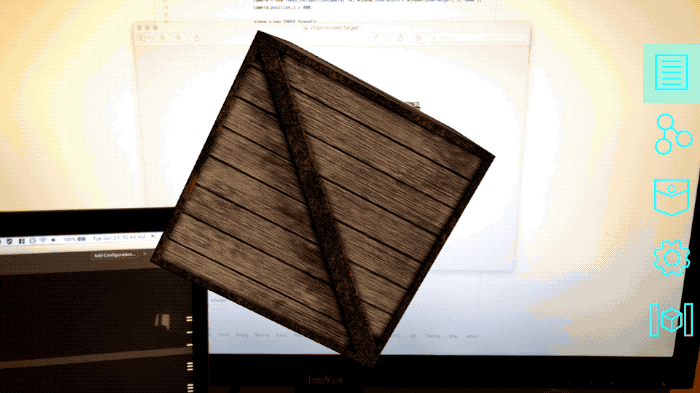
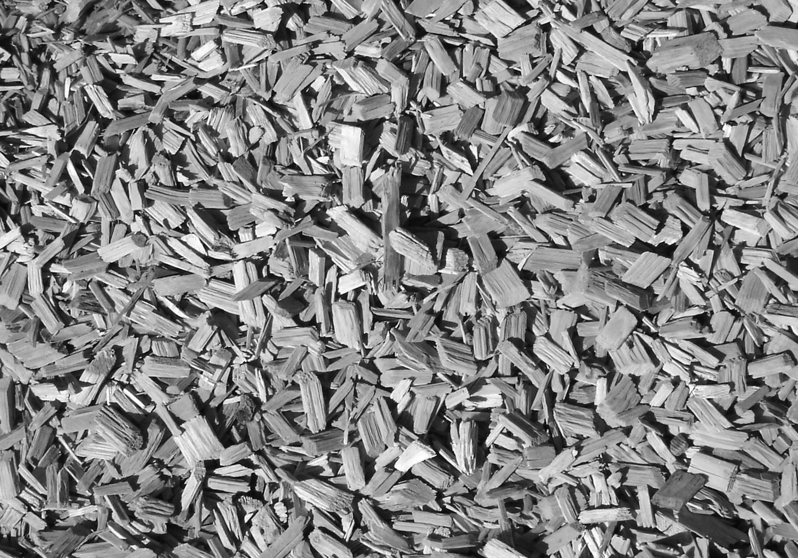

## Intermediate Tool Tutorial: 3D Graphics with three.js

Pre-reqs: [Creating a Simple Tool](../develop/spatial-tools/tutorial) and
[How to Create an Object](../use/connect-to-the-physical-world/create-object)

In this tutorial, we'll explore how to build tools that leverage 3D graphics, rather than just being a 2D panel in 3D
space. There are several popular libraries for rendering WebGL content in the browser using JavaScript, one of which
is [three.js](https://threejs.org). We'll adapt one of the simplest three.js
[example projects](https://threejs.org/examples/#webgl_geometry_cube) – a textured 3D cube – into a tool compatible
 with the Vuforia Spatial Toolbox.



Whereas in some other tutorials we've created **global** tools in a new add-on, which get added to the pocket in the
app, we'll create this tool as a **custom** tool attached to a specific object, as shown at the end of the [How to
Create an Object](../use/connect-to-the-physical-world/create-object) tutorial. Follow that tutorial to create a
new object, attach an image target to it, and add a tool to it using the web interface. The tool will default to
looking like a blue square.

You can either follow along, or
[download this object](https://github.com/ptcrealitylab/vuforia-spatial-toolbox-documentation/raw/master/tutorials/downloads/threejsTestObject.zip)
and unzip it into your `spatialTools` directory. Restart your server and app and the new object should appear when you
look at this image:


 
Let's look at the final code, and explain everything afterwards step-by-step. If you didn't download the zip of the
finished product, and are instead building this from scratch, find your object in your `spatialTools` directory, and
locate the `index.html` file for the custom tool you just added. Replace the contents with the following code. Each
noteworthy block of code has been commented with a step number. Each of these steps is explained in detail afterwards.

```html
<!DOCTYPE html>
<html lang="en">
<head>
  <title>three.js Spatial Toolbox Example</title>
  <meta charset="utf-8">
  <meta name="viewport" content="width=device-width, user-scalable=no, minimum-scale=1.0, maximum-scale=1.0">
</head>
<body>
<!-- 1. Import the three.js library -->
<script src="three.min.js"></script>
<script>
  // 2. set up some variables for the three.js scene
  let camera, scene, renderer;
  let containerObj;
  let mesh;
  let rendererWidth = screen.height; // width is height because landscape orientation
  let rendererHeight = screen.width; // height is width
  let isProjectionMatrixSet = false;

  // 3. Initialize the Spatial Toolbox API
  let spatialInterface = new SpatialInterface();

  window.onload = function () {
    // 4. Initialize the three.js renderer
    renderer = new THREE.WebGLRenderer({alpha: true});
    renderer.setPixelRatio(window.devicePixelRatio);
    renderer.setSize(rendererWidth, rendererHeight);
    document.body.appendChild(renderer.domElement);

    // 5. Initialize the three.js scene with a camera and contents
    camera = new THREE.PerspectiveCamera(70, rendererWidth / rendererHeight, 1, 1000);
    scene = new THREE.Scene();
    containerObj = new THREE.Object3D();
    containerObj.matrixAutoUpdate = false;
    scene.add(containerObj);

    // 6. Add some content to the scene's container object - customize this!
    let texture = new THREE.TextureLoader().load('textures/crate.gif');
    let geometry = new THREE.BoxBufferGeometry(100, 100, 100);
    let material = new THREE.MeshBasicMaterial({map: texture});
    mesh = new THREE.Mesh(geometry, material);
    mesh.position.setZ(50);
    containerObj.add(mesh);

    // 7. Use the Spatial Toolbox APIs to prepare to render correctly
    spatialInterface.setFullScreenOn();
    spatialInterface.addMatrixListener(renderScene);
  };

  // 8. This main rendering loop will get called 60 times per second
  function renderScene(modelViewMatrix, projectionMatrix) {

    // 9. only set the projection matrix for the camera 1 time, since it stays the same
    if (!isProjectionMatrixSet && projectionMatrix.length > 0) {
      setMatrixFromArray(camera.projectionMatrix, projectionMatrix);
      isProjectionMatrixSet = true;
    }

    // 10. Every frame, set the position of the containerObj to the modelViewMatrix
    if (isProjectionMatrixSet) {
      setMatrixFromArray(containerObj.matrix, modelViewMatrix);
      mesh.rotation.z += 0.01; // make it spin
      renderer.render(scene, camera);
    }
  }

  // 11. This is just a helper function to set a three.js matrix using an array
  function setMatrixFromArray(matrix, array) {
    matrix.set( array[0], array[4], array[8], array[12],
                array[1], array[5], array[9], array[13],
                array[2], array[6], array[10], array[14],
                array[3], array[7], array[11], array[15]);
  }

  // 12. Make sure the 3d renderer always has the right aspect ratio of the screen
  window.addEventListener('resize', function() {
    rendererWidth = window.innerWidth;
    rendererHeight = window.innerHeight;

    if (camera) {
      camera.aspect = rendererWidth / rendererHeight;
      camera.updateProjectionMatrix();
    }

    if (renderer) {
      renderer.setSize(rendererWidth, rendererHeight);
    }
  });
</script>
</body>
</html>
```

### Step 1.

```html
<!-- 1. Import the three.js library -->
<script src="three.min.js"></script>
```

First off, you need to download the three.js library. You should probably download the whole project from
[threejs.org](https://threejs.org) or [GitHub](https://github.com/mrdoob/three.js/), as it contains additional
examples and library extensions that you'll likely need for anything other than a bare-bones use case, but the only
file you really need for this tutorial is [three.min.js](https://github.com/mrdoob/three.js/blob/dev/build/three.min.js)
(you can click on "Raw" and then do a "File > Save As" to download only that file, making sure to name it three.min.js).
Put that file in the same directory as your tool's index.html.

### Step 2.

```javascript
// 2. set up some variables for the three.js scene
let camera, scene, renderer;
let containerObj;
let mesh;
let rendererWidth = screen.height; // width is height because landscape orientation
let rendererHeight = screen.width; // height is width
let isProjectionMatrixSet = false;
```

At the top of our script, we need to declare some variables that we will later use throughout the example. `camera`,
`scene`, and `renderer` are necessary for any three.js project. The `containerObj` will be added to the three.js
scene and repositioned when we move the Spatial Toolbox camera around to make all of its contents render from the
right perspective (so that they "stick" in space like AR content should). `mesh` will be our 3D cube. The renderer
width and height get used to set up three.js with the right size and aspect ratio. `isProjectionMatrixSet` is a
flag we'll use later to tell when our scene is initialized.

### Step 3.

```javascript
// 3. Initialize the Spatial Toolbox API
let spatialInterface = new SpatialInterface();
```

Just like all the other tools you build, add this line to connect to the Spatial Toolbox APIs.

### Step 4.

```javascript
// 4. Initialize the three.js renderer
renderer = new THREE.WebGLRenderer({alpha: true});
renderer.setPixelRatio(window.devicePixelRatio);
renderer.setSize(rendererWidth, rendererHeight);
document.body.appendChild(renderer.domElement);
```

Here, we create a new WebGL renderer and add it to the HTML document. `{alpha: true}` makes the background
transparent instead of black, so we don't obscure the entire app with the renderer. `setPixelRatio` makes everything
render crisply on a high-resolution phone screen, and `setSize` sets the size of the canvas and viewport so that it
fills the entire HTML document rather than being cropped down.

For more documentation on setting up a basic three.js scene, you can read the official
[three.js tutorial](https://threejs.org/docs/index.html#manual/en/introduction/Creating-a-scene).

### Step 5.

```javascript
// 5. Initialize the three.js scene with a camera and contents
camera = new THREE.PerspectiveCamera(70, rendererWidth / rendererHeight, 1, 1000);
scene = new THREE.Scene();
containerObj = new THREE.Object3D();
containerObj.matrixAutoUpdate = false;
scene.add(containerObj);
```

In addition to the `renderer` defined in the previous step, all three.js projects will need a `scene` to contain all
the 3D objects, and a `camera` to define what perspective to view the scene from. Here, we first create a camera
with a few parameters - the field of view, aspect ratio, and the "near and far planes" (if something is too close
or too far away from the camera, it won't get rendered). We then create a new (empty) scene and add an object to
it called the `containerObj`. Any 3D content that you want to see should get added to this `containerObj`, as we
will later use the `spatialInterface` APIs to reposition it based on the movement of the phone. The way that we'll
set the position of the `containerObj` requires us to set `matrixAutoUpdate` to false.       

### Step 6.

```javascript
// 6. Add some content to the scene's container object - you can customize this!
let texture = new THREE.TextureLoader().load('textures/crate.gif');
let geometry = new THREE.BoxBufferGeometry(100, 100, 100);
let material = new THREE.MeshBasicMaterial({map: texture});
mesh = new THREE.Mesh(geometry, material);
mesh.position.setZ(50);
containerObj.add(mesh);
```

Here's the real meat of the application. Everything else in this tutorial is pretty much the scaffolding that makes
this scene run, but this step is where we put the 3D contents into the scene. To test it out, we add a box to the
scene. You can [download the crate.gif](https://github.com/mrdoob/three.js/blob/master/examples/textures/crate.gif)
file from the three.js examples and add it to a new directory in your tool called `textures`.

Feel free to play around with this step and swap out the crate with other 3D content. Be aware that many of the other
three.js examples will require you to include additional scripts - try the crate first to make sure it works.

### Step 7.

```javascript
// 7. Use the Spatial Toolbox APIs to prepare to render correctly
spatialInterface.setFullScreenOn();
spatialInterface.addMatrixListener(renderScene);
```

Here are the two key lines where we use the Spatial Toolbox APIs to make this 3D scene work.

`setFullScreenOn` makes this tool ignore the regular Spatial Toolbox rendering, which normally tries to render this
tool as a 2D panel floating somewhere in 3D space. When we call this, the tool instead "sticks" to the screen and
resizes to fill the full width and height of the screen. On it's own, this breaks the AR behavior of this tool.

`addMatrixListener` lets us fix the AR behavior by subscribing to the 3D position in space that the Spatial Toolbox
would normally have placed this tool. We can then give this 3D position to the three.js scene so that it renders
itself with the correct perspective. The details of this are implemented in steps 7 – 9.

### Step 8. 

```javascript
// 8. This main rendering loop will get called 60 times per second
function renderScene(modelViewMatrix, projectionMatrix) {
```

This defines the callback that `addMatrixListener` from Step 6 triggers. It will get called constantly (60 times per
second) while this tool is visible. It has two parameters: `modelViewMatrix` and `projectionMatrix`. If you're
unfamiliar with 3D graphics programming, those names probably mean nothing to you. Here's a super quick Computer
Graphics 101:

- A "matrix" in computer graphics is a way to store position, rotation, and scale information in a very efficient way
  (but they are notoriously hard to understand).
- Rendering any 3D object (like a cube) onto a 2D screen (like your phone screen) relies on 3 matrices: the "**model**"
  matrix, the "**view**" matrix, and the "**projection**" matrix.
- The model matrix stores **where an object is** (and how it is rotated/scaled), relative to some origin point in the
  scene.
- The view matrix essentially stores **where the camera is**, relative to the same origin point in the scene. (It's a
  bit more complicated than this, but if you don't know computer graphics you can just think of it as the camera
  position).
- The projection matrix stores some **camera parameters** similar to the way we set up the camera in step 5: things
  like the field of view, the camera/screen's aspect ratio, and how far the camera can see. This will be a constant
  – it doesn't change over time as the object or the camera moves around.
- We can combine matrices together. Oftentimes, the model matrix and the view matrix are combined into a single
  "modelView matrix" which represents where an object is relative to how the camera sees it.

With that context, the parameters of this function should make a bit of sense. Every frame, as we move the phone
camera around, this tool is notified of its modelView matrix – how it should be rendered relative to the camera's
current position. We also get the projection matrix every frame, but we only need to store it once because it never
changes.

### Step 9.

```javascript
// 9. only set the projection matrix for the camera 1 time, since it stays the same
if (!isProjectionMatrixSet && projectionMatrix.length > 0) {
  setMatrixFromArray(camera.projectionMatrix, projectionMatrix);
  isProjectionMatrixSet = true;
}
```

The first step inside this function is to set the `camera.projectionMatrix` to the projection matrix we get from the
Spatial Toolbox. This'll make the three.js camera consistent with the way the rest of the Spatial Toolbox is
rendering. It only needs to happen once, so we wrap it in an if-statement.

### Step 10.

```javascript
// 10. Every frame, set the position of the containerObj to the modelViewMatrix
if (isProjectionMatrixSet) {
  setMatrixFromArray(containerObj.matrix, modelViewMatrix);
  mesh.rotation.z += 0.01; // make it spin
  renderer.render(scene, camera);
}
```

This step happens every frame after we successfully set the projection matrix. Here, we set the `containerObj.matrix`
to the modelView matrix from the Spatial Toolbox. This positions all the content of the three.js scene to be viewed
from the phone's current position.

`mesh.rotation.z += 0.01` is an optional step, which animates the cube so that it slowly rotates in place. This is to
point out a good spot in the code to add any continuously updating animations or behavior. You can speed it up, stop
it, scale it up or down, add rotations in other directions, etc.

Calling `renderer.render(scene, camera)` actually draws the resulting pixels onto the screen.

### Step 11.

```javascript
// 11. This is just a helper function to set a three.js matrix using an array
function setMatrixFromArray(matrix, array) {
  matrix.set( array[0], array[4], array[8], array[12],
              array[1], array[5], array[9], array[13],
              array[2], array[6], array[10], array[14],
              array[3], array[7], array[11], array[15]);
}
```

You can just copy-and-paste this into your code. Trying to do `containerObj.matrix = modelViewMatrix` doesn't work,
so instead we have this helper function to use the three.js matrix `set` method to assign a new value to a matrix
using the data in the format provided by the Spatial Toolbox APIs.

### Step 12.

```
// 12. Make sure the 3d renderer always has the right aspect ratio of the screen
window.addEventListener('resize', function() {
  rendererWidth = window.innerWidth;
  rendererHeight = window.innerHeight;

  if (camera) {
    camera.aspect = rendererWidth / rendererHeight;
    camera.updateProjectionMatrix();
  }

  if (renderer) {
    renderer.setSize(rendererWidth, rendererHeight);
  }
});
```

This final step is a safety net that will resize the renderer and camera aspect ratio if the size of the tool or the
 screen ever changes. It isn't always needed, but including this will prevent some edge-case bugs.

And with that, the 3D tool is complete! Run your Spatial Toolbox, look at your image target, and you should see a
crate appear as if sitting on the target image. As you move your phone around you'll be able to view the different
sides of it.

If you look back at the original
[three.js example source code](https://github.com/mrdoob/three.js/blob/master/examples/webgl_geometry_cube.html)
you can see what changes were needed to turn it into a Spatial Tool. The main differences are:  
  - In Step 5, we create a container object for our scene's contents, and set its `matrixAutoUpdate` to false. By
    doing so, we can directly set its `matrix` property rather than use it's `position`, `rotation`, and `scale`
    properties.
  - In Step 7, we use the SpatialInterface to trigger the main update loop in response to new matrices from the
    Spatial Toolbox, rather than loop using `requestAnimationFrame`.
  - In Step 9 and 10, we set the camera's projection matrix and the containerObj's modelView matrix using data from
    the Spatial Toolbox.
  
If you make note of those differences you should be able to convert just about any three.js example into a Spatial Tool.

Did you get this working? Share a screenshot of your 3D tool on the [forum](https://forum.spatialtoolbox.vuforia.com)!
