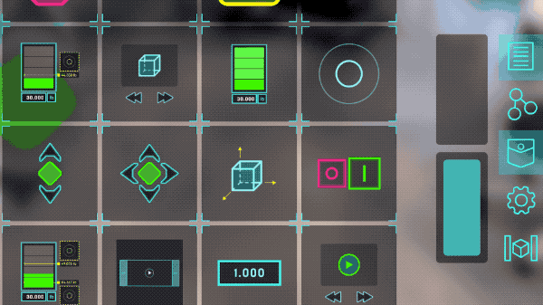
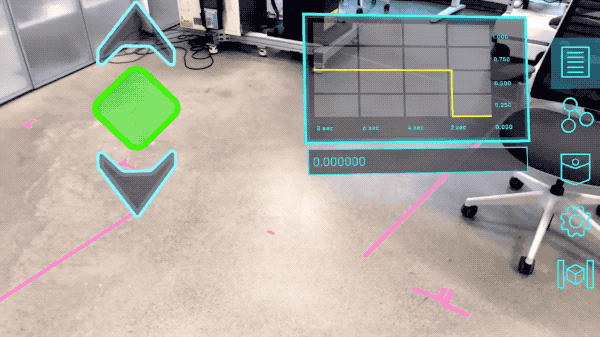
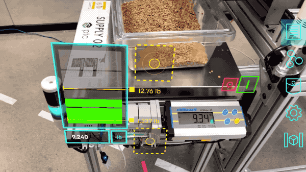
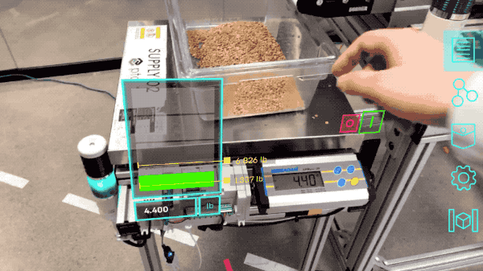

## Getting Started with the Vuforia Spatial Toolbox

This series of pages will give you an illustrated introduction to using the Vuforia Spatial Toolbox
app. By the end of this section, you'll know about a wide variety of things you can do in AR
using the Spatial Toolbox app, and you should be ready to try it out for yourself. You'll learn
how to add new *tools* to a space and connect them together into spatial programs.

You'll also learn how to set up a Vuforia Spatial Edge Server, if you want to do more with the
app, and how to configure it through a web interface on your computer.

If you're _not_ a developer, this is the most important (and maybe the only) section for you to
read.

If you _are_ a developer, you should read this first, and then read the Develop section after you
feel comfortable using the app and server.

## Main Concepts

### Tools

The Spatial Toolbox gives you a set of *tools* that you can add to your AR environment. Tools are
pieces of AR content that can be added, moved around, and combined into spatial computing scenarios.

In this example, we take a graph tool from our toolbox and add it to the world.

### Nodes

Each tool can have one or more *nodes*. Nodes are programmable data points with a spatial
location. They can act as an input for a tool, or an output, or both. By *linking* together the
nodes of different tools, we create a data stream from one to the other. This lets us wire a set
of tools together into a spatial program.

In this example, we connect a slider tool to the a tool, so that when we drag the handle of the
slider up and down we visualize the data it generates on the graph. This is the simplest example
of a spatial program.

 

### Objects

In addition to placing tools so that they "float" in the world in front of us, we can also
attach them to specific *objects* that our Vuforia AR tracker can recognize. These can be as
simple as a QR code or as complex as a 3D scan of a machine or larger space.

In this case, we have attached some tools to an industrial machine. The AR user interface appears
when we approach the machine.

Note: you won't be able to detect objects like this by default. To do that, you'll need to learn
about setting up a Vuforia Spatial Edge Server and configuring a set of objects on it.

### Programming the Physical World

Tools become even more interesting when you bring in the ability to connect their data (their nodes)
with things in the physical world. For example, using tools to visualize the data being
generated by machines, or using the Toolbox to link multiple IoT devices into an automated
process. How can we do this? We can set up certain nodes to read or write data to other systems
and hardware, and then link those nodes to our tools.

In this example, the the scale has a node for the weight value, which it reads using our Kepware
connector. We have linked that node to the node of this tool to visualize how much weight is on
it. You can see the UI change as we press down on the table. 

Again, this feature won't be available by default if you just download the app. You'll need to
set up a Vuforia Spatial Edge Server and learn how to use *Hardware Interfaces*.

### Read Next:

[Using the App](./using-the-app) – this illustrated guide will teach you everything you need to
know to use all the features of the Vuforia Spatial Toolbox app.
