## How to create an Object with an AR interface

In this tutorial, you will learn how to create and configure a new [object](../../dive-deeper/data-model#object)
on your Edge Server, and attach custom AR content to it. This is essential to making full use of
the Vuforia Spatial Toolbox, going beyond purely-digital experiences and integrating your
creations with the physical world.

Tutorial pre-reqs:

1. [Install a Vuforia Spatial Edge Server](./startSystem)
2. Start your Edge Server

Also recommended: read about how to use the [Web Interface Manager](./web-interface-manager).

### Creating an Object on the Server

Objects, as a reminder, let us attach tools to physical objects, so that they don't just float
around in space but "stick" to images or things as we move them around. We do this by attaching
a Vuforia target to each object. Objects get created and configured on the server.

Go to [http://localhost:8080](http://localhost:8080) after starting your server. If you've never
created an object, the web interface will look like this.

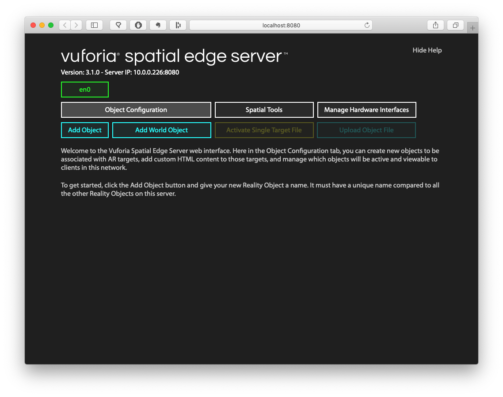

Click on "Add Object", type in the name `book`, and click the green "Add" button to create a new
object with the name "book".

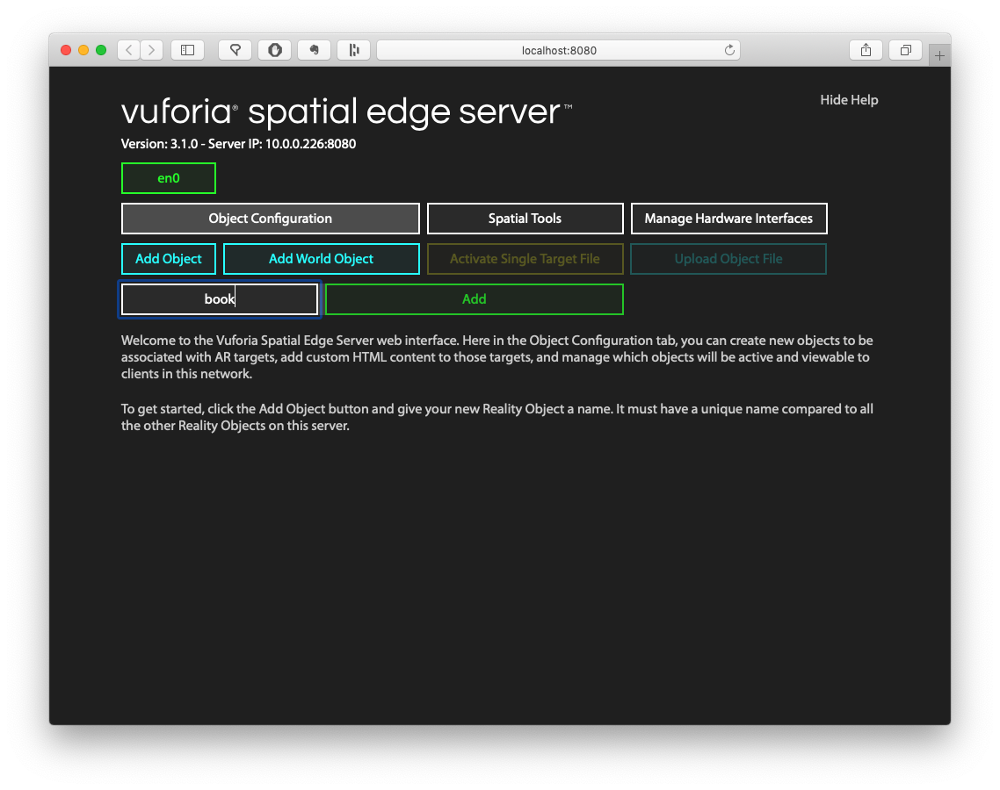

After clicking "Add," you'll see an entry for your new object, but it isn't initialized yet.
Objects become initialized when you attach a Vuforia target to them.

*Note: if you mess up at any point and want to restart, just click the red [X] to delete your
object, and start the instructions again from the beginning.*

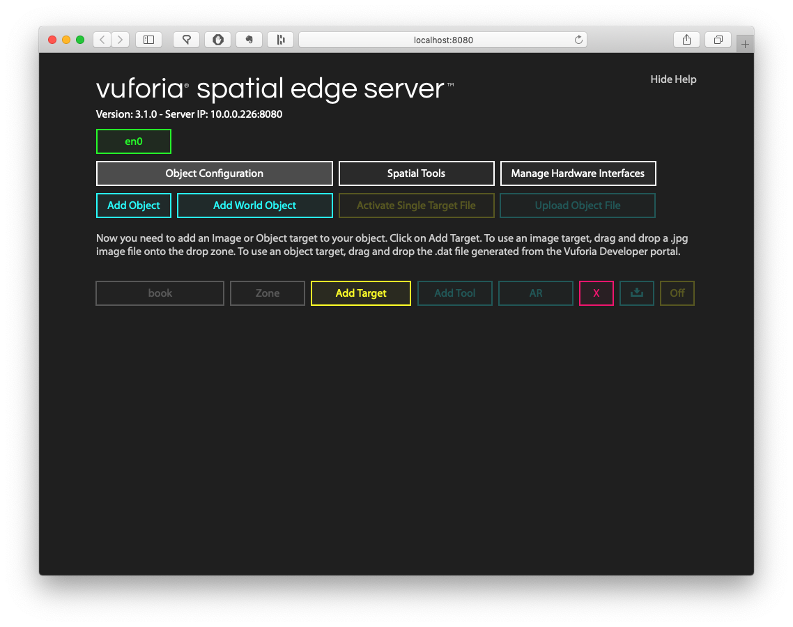

### Attaching a Vuforia Target to your object

Now you need to decide which real thing in your physical environment you want to attach AR
content to. Rather than posting a JPG for you to download, I encourage you to find something
physical that you can use – it's a lot more satisfying to augment your world than reuse my demo
project. Some recommendations: book covers or product packages (food labels usually work well).
Whatever you choose should be flat, and have a lot of visual detail. The less unique details it
has, the worse it will track in AR. I decided to augment some book covers of classics on my shelf.


I took a photo with my phone of the Fahrenheit 451 cover, cropped it so that none of the
background is showing, sent it to my computer, and exported it as a JPG file (it was originally
a different format – needs to be JPG).

Take some time to do the same. If you can't find something in your environment, you can also
 download some sample images from the
[Vuforia Engine developer portal](https://library.vuforia.com/content/vuforia-library/en/articles/Solution/sample-apps-target-pdfs.html)
(click on any of the "Download" links for a PDF, and then export a page from the PDF as a JPG).

Now that you have an image of your object, go back to the web interface and click on the "Add
Target" button to show the "Drop Zone". Drag and drop your JPG file on top of the Drop Zone.

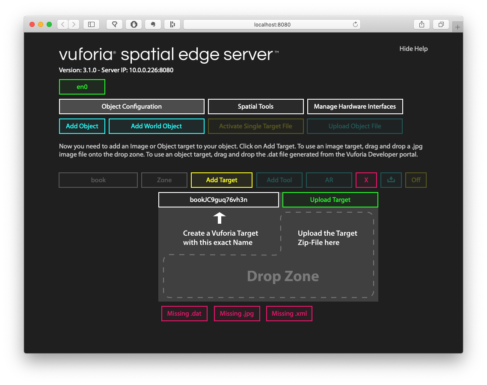

If successful, the page will refresh and the "Add Target" will now say "Edit Target" and show an
icon of the image you uploaded. If it fails, make sure your image is an uncorrupted JPG file.
Try with a different JPG if it still doesn't work.

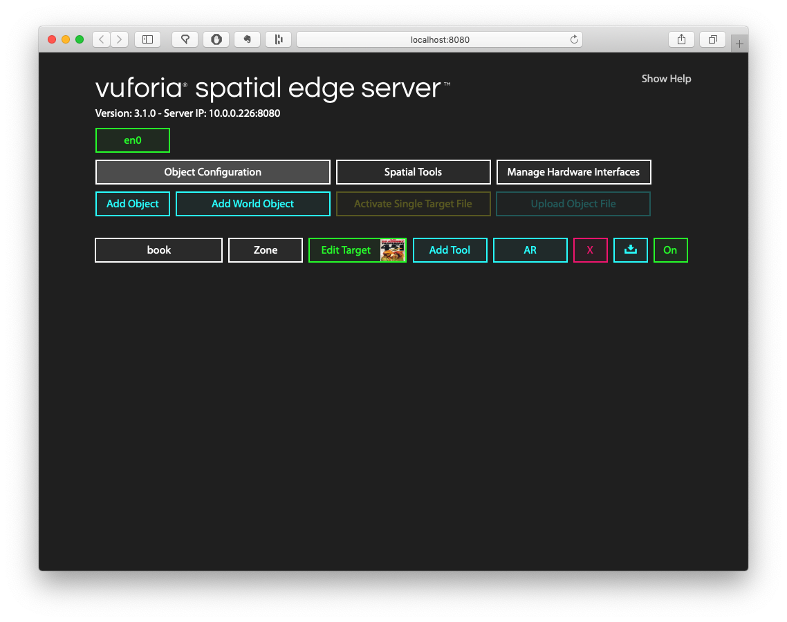

### Add a custom tool to your object

At this point, your Vuforia Spatial Toolbox app will recognize this object, but there isn't any
AR content on it yet. To give it some default content (that we can edit later) click on the "Add
Tool" button, type in the name `interface`, and click the green "Add" button to create a new
tool attached to that object.

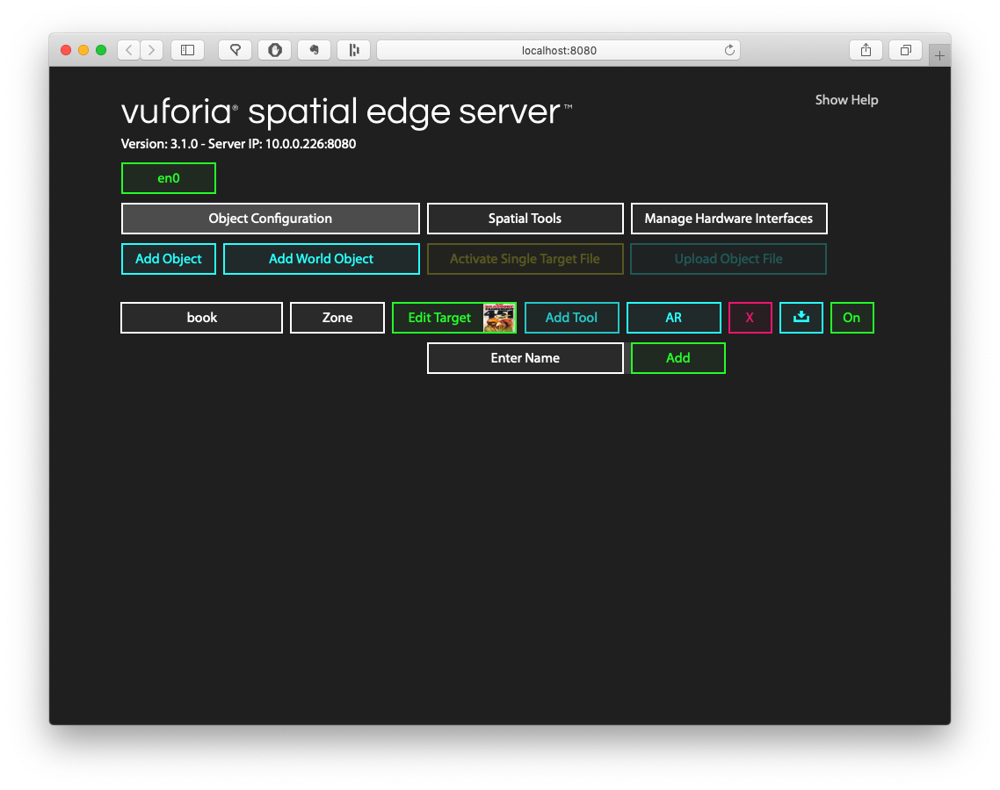

This has added a new custom tool to this object. This is a "local" tool that is unique to this
object, rather than being a copy of a tool that is in the pocket. We'll explore what we can do
with this tool a bit further down.

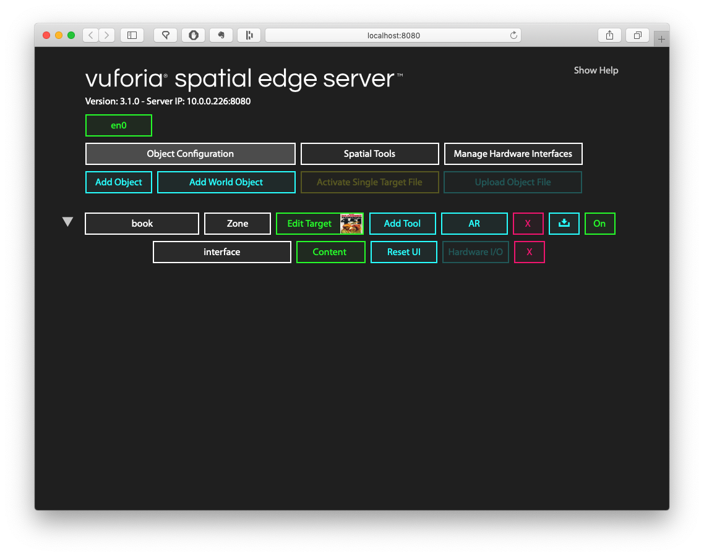

At this point, everything is ready! Make sure your phone is connected to the same WiFi network as
the computer whose Edge Server you added the object to. Open the Vuforia Spatial Toolbox app.

Point your camera at whatever you took the photo of (or of the image on your computer screen, if
you don't have the physical object on hand). You should see a blue square show up in AR! As you
move the object around, the interface will move with it.

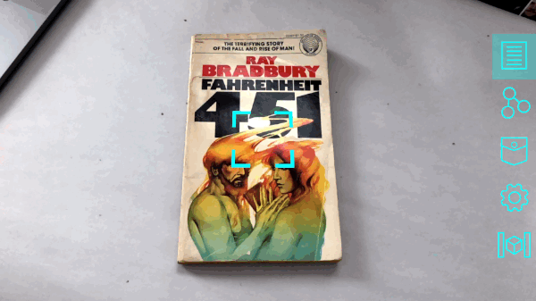

If you don't see the blue AR square when you look at your object, check out the
[troubleshooting](#troubleshooting) section at the bottom of this page.

### Dropping tools onto your object

If you drop new tools into the scene **while this object is visible on the screen** the tools
will attach to this object rather than float in the world. Tools will always try to attach to
the closest object visible to the camera. If you move the object around after attaching more
tools, you'll see all the tools move with it.

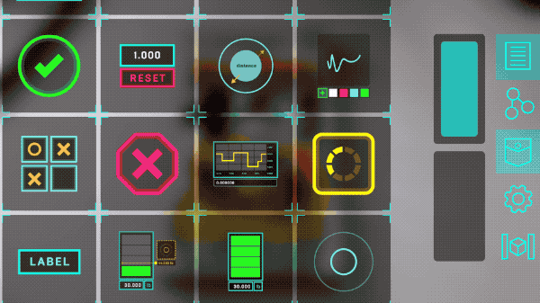

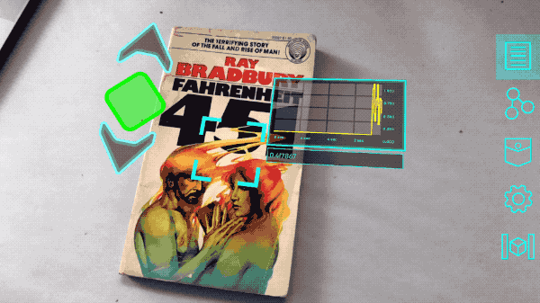

### Customizing your tool!

Besides attaching additional tools to this object, we can also customize its AR interface by
editing the first tool we created, so that it's more interesting than a blue square.

The key insight here is that the blue square is just a small HTML page that gets placed as a
panel on your object. If you don't know any HTML or web development, you'll need to learn some
before being able to customize your tool. The more web development you know, the more you can
do with the tool.

First, you need to find the tool on your filesystem. When you ran your edge server and created an
object, it automatically created a folder called `realityobjects` in your `~/Documents` directory.
Open up `~/Documents/realityobjects/book` to see all the contents of your object named "book."
There will be a directory in here for each custom frame we added using the web interface. If you
named everything the same as I did, you'll see a directory called `interface`.  Open that up and
there is an `index.html` file that you can edit, as if it were a standard web page. The contents
of this file will be rendered as a panel in AR when you look at the object.

Let's make a small change to see that it works. Replace the contents of index.html with the
following:

```
<!doctype html>
<html>
<head>
<meta charset="UTF-8">
<title>Default UI</title>
	<script src="object.js"></script>
	<script>
		var reality = new SpatialInterface();
        reality.setMoveDelay(10);
	</script>
	<style>
		body {
			background-color: rgba(255, 50, 100, 0.5);
		}
	</style>
</head>
<body style="height: 300px; width: 300px">
	
</body>
</html>
```

The only difference from the default contents is that we added a semi-transparent red background
to the body.

Restart your app and look at your object. You should see the new version!

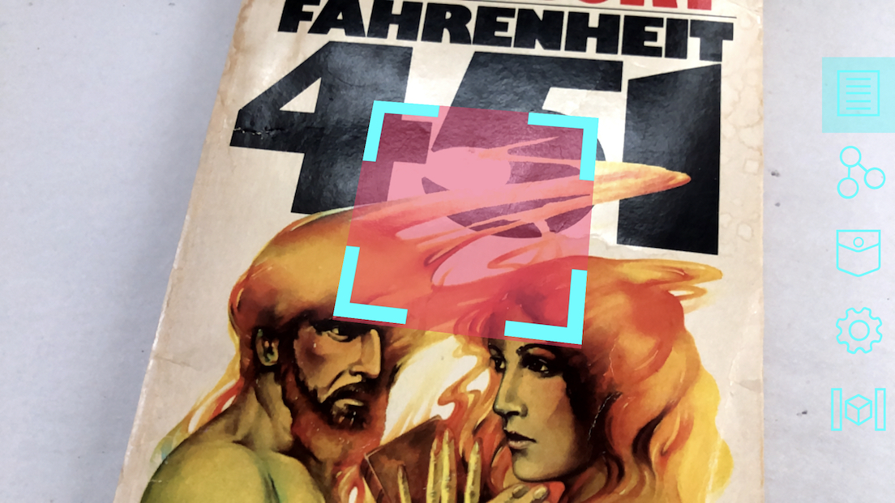

### What Next?

Feel free to get creative and build a fun or useful user interface for the object. Looking at a
book? Draw some new cover art for it and add the image to the HTML page. Or build a UI with
additional info about the author, or recommended titles. Looking at a food label? Maybe the
user should see the calorie count, or other nutrition info.

If you read the [introductory Spatial Tool tutorial](../../develop/spatial-tools/tutorial) you'll
learn how to interact with the JavaScript API for adding nodes to tools. You can do the same
thing here, to make a programmable user interface for your object. There are also plenty of
other [Spatial Tool APIs](../../develop/spatial-tools/api-reference) that you can read about
if you get past the first tutorial.

Did you follow along this tutorial to the end? Show us what you made in the
[forum](https://forum.spatialtoolbox.vuforia.com)!

<a id="troubleshooting"></a>
### Troubleshooting

If you don't see the blue square pop up when you point the camera at your object, check the
following:

1. Is your Edge Server turned on? Go to localhost:8080 on your computer. If it fails to load the
   web interface, the server needs to be restarted.
2. Are your Edge Server and phone connected to the same WiFi network? If not, your phone will not
   find the objects on the server.
3. Go to the Settings menu and then click on the "Found Objects" button – do you see the name of
   your object ("book") in this list, with the name of the tool ("interface") underneath it? If you
   don't, that means the Toolbox app didn't hear about this object from the server. If it appears,
   but the name is red, that means there was a problem initializing the AR target from the image
   you uploaded. You might have uploaded a corrupted JPG file, or another unsupported filetype.
4. Does your WiFi network support "multicasting"? Some corporate networks disable this feature,
   which is needed for your app to discover the server. Try a different WiFi network.

Talk to us on the [forum](https://forum.spatialtoolbox.vuforia.com) if you run into any problems
you can't fix.
