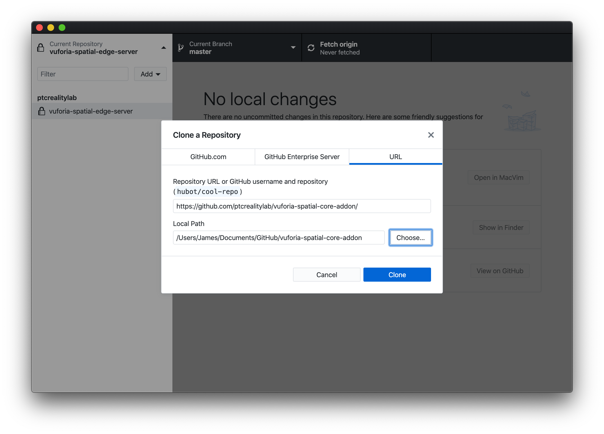
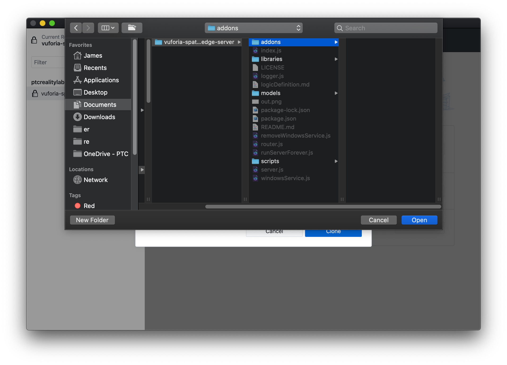
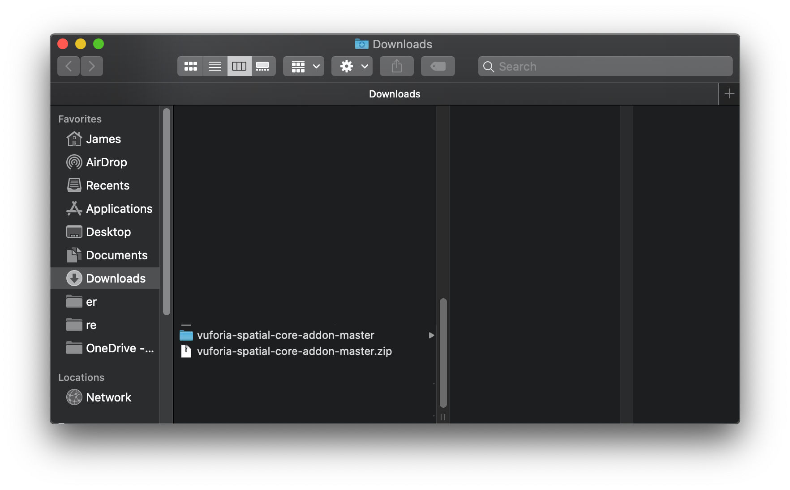
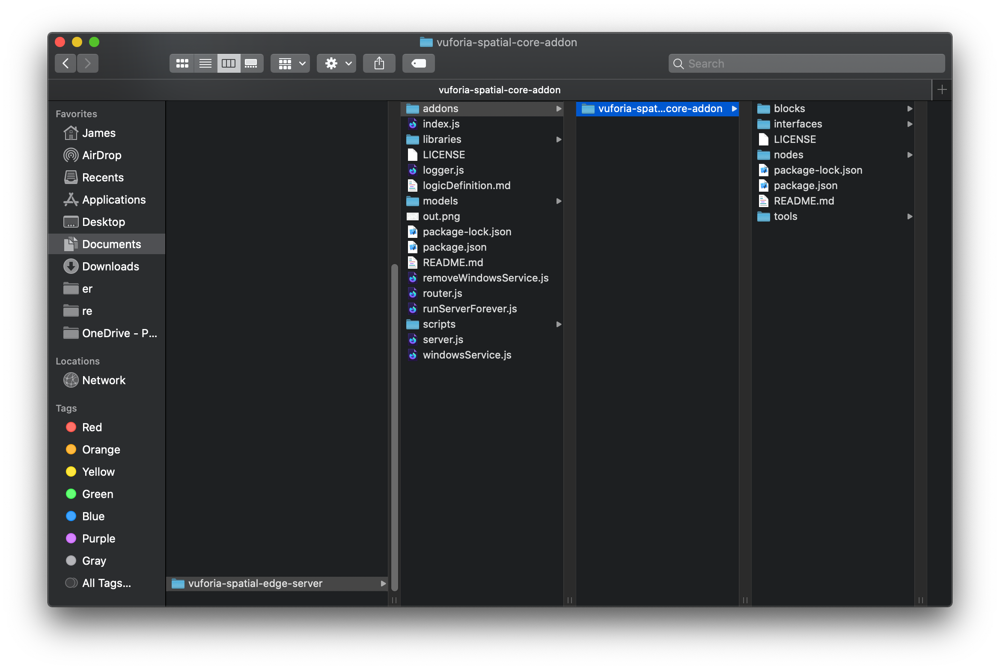
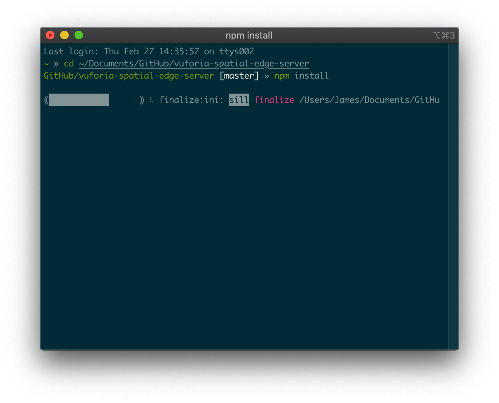
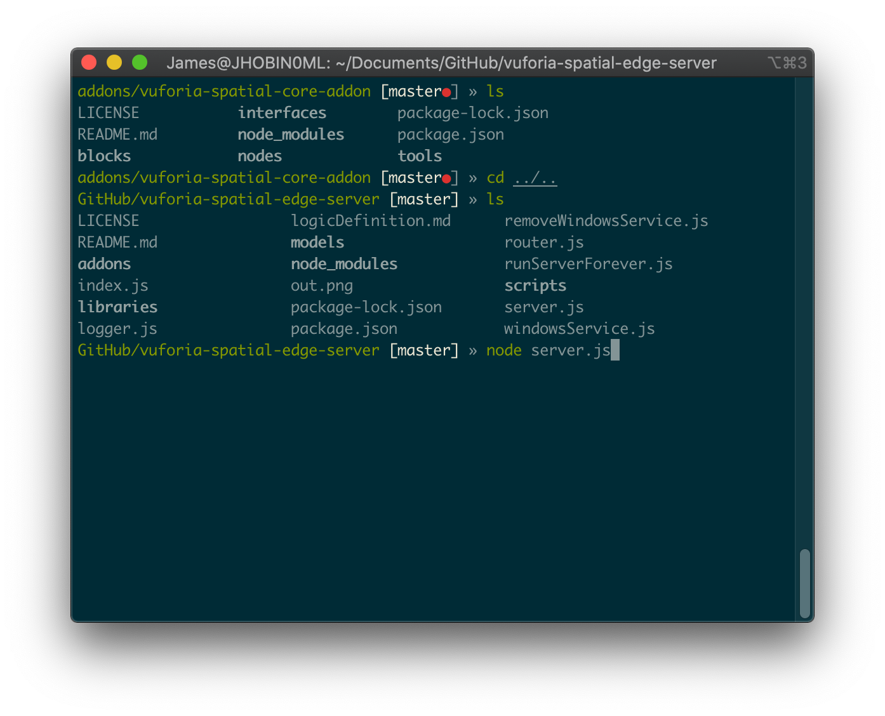

## Starting the Vuforia Spatial Edge Server on Mac

## Install Node

Follow the instructions on Node's website to install `node` and `npm`:
https://nodejs.org/en/. If installing succeeding, you'll be able to open
Terminal and run `node --version`:

## Get the Edge Server

### Install GitHub Desktop (Optional)

Follow the [instructions on GitHub's website](https://help.github.com/en/desktop/getting-started-with-github-desktop/installing-github-desktop) to install the GitHub desktop app. Open it up and sign in to get started.

### Download Edge Server

#### With GitHub Desktop
In GitHub Desktop select Clone Repository (under the "Add" menu if the button isn't immediately visible). Once there, paste the edge server's repository url, https://github.com/ptcrealitylab/vuforia-spatial-edge-server/ and click Clone.

#### With a Browser
Download the current source code from [this
link](https://github.com/ptcrealitylab/vuforia-spatial-edge-server/archive/master.zip)
and unzip it. In the following example I've unzipped it then moved it into my
Documents directory:

### Download Core Add-on

#### With GitHub Desktop
Open GitHub Desktop and use the same Clone Repository dialog to clone
https://github.com/ptcrealitylab/vuforia-spatial-core-addon/ to the addons
subdirectory of vuforia-spatial-edge-server. Note that in the "Choose Folder"
dialog you will have to create a new folder named "addons."

#### With a Browser

Download the current source code from [this
link](https://github.com/ptcrealitylab/vuforia-spatial-core-addon/archive/master.zip).
Unzip it and move it into a new folder named "addons" inside your vuforia-spatial-edge-server directory.

Once you're done with all the unzipping and directory management, your full
layout should look like this:

## Install Dependencies

Track down the Edge Server directory from the previous step in Terminal. If you
put the edge server in your Documents directory and kept the default name
`vuforia-spatial-edge-server`, you can get to it with the command `cd
~/Documents/vuforia-spatial-edge-server`.

Once you're in the correct directory, you can confirm this with the command
`ls` which should output something close to the following:

Now that you've confirmed that you're in the right location you can run the
command `npm install`.

We also need to install the dependencies for the core add-on. In the edge
server directory, run `cd addons/vuforia-spatial-core-addon` to get into the
core add-on's main directory. Here you can run `npm install` again to install
the core add-on's specific dependencies.

## Start the Edge Server

Now, return to the edge server's directory by running `cd ../../`. You can
confirm you're in the correct directory by running `ls` again. Now you're here,
you can run `node index.js` to start the server.

