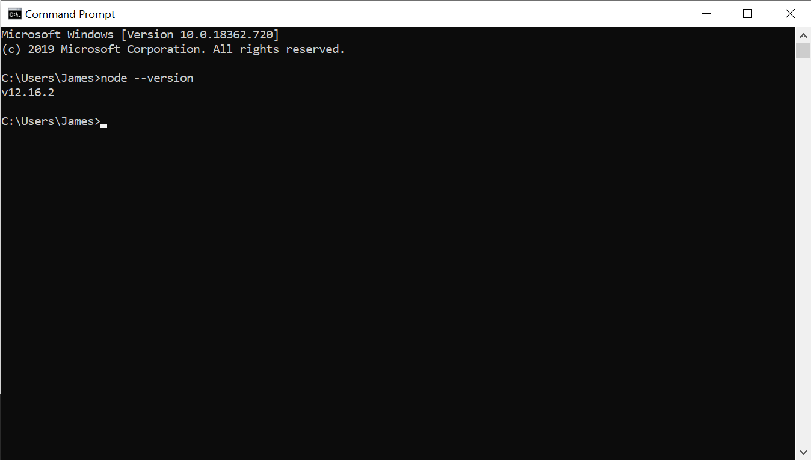
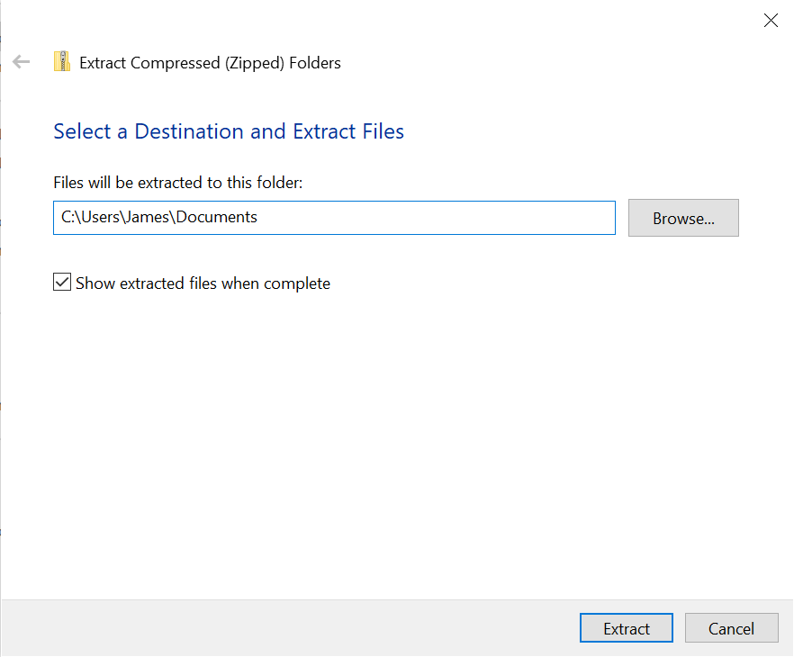
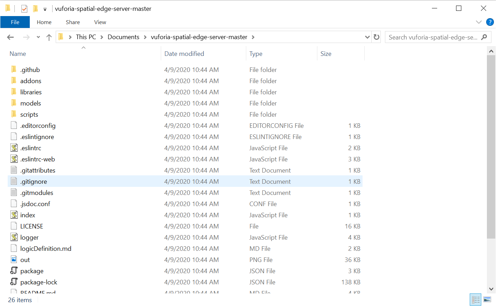
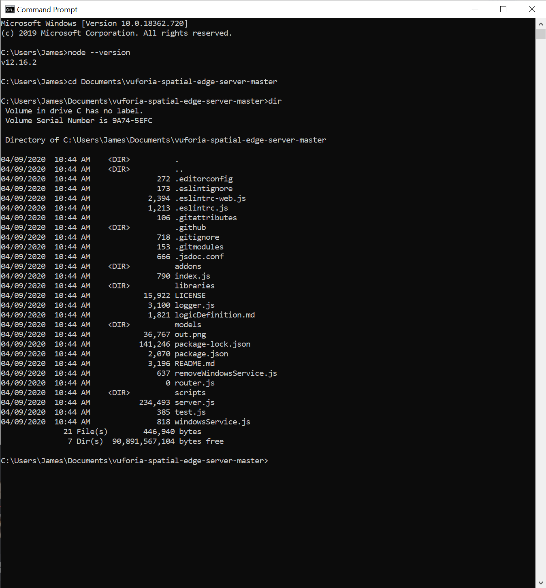
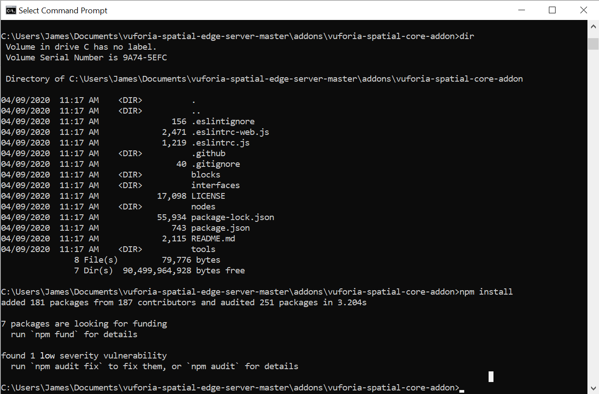
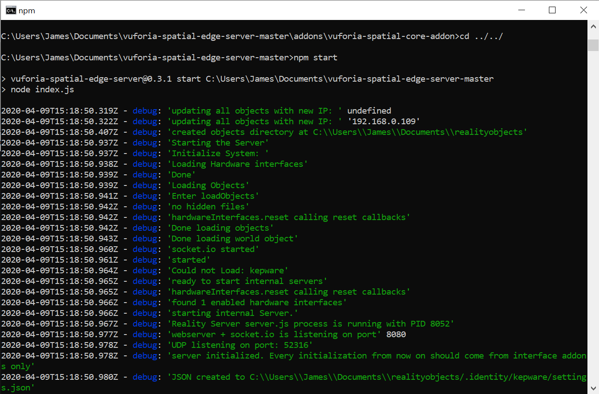

## Starting the Vuforia Spatial Edge Server on Windows

## Install Node

Follow the instructions on Node's website to install `node` and `npm`:
[https://nodejs.org/en/](https://nodejs.org/en/). Make sure to click the
checkbox to install Chocolatey during the setup process. If installation
succeeded, you'll be able to open Command Prompt and run `node --version`:

## Get the Edge Server

### Install GitHub Desktop (Optional)

Follow the [instructions on GitHub's
website](https://help.github.com/en/desktop/getting-started-with-github-desktop/installing-github-desktop)
to install the GitHub desktop app. Open it up and sign in to get started.

### Download Edge Server

#### With GitHub Desktop
In GitHub Desktop select Clone Repository (under the "Add" menu if the button
isn't immediately visible). Once there, paste the edge server's repository url,
[https://github.com/ptcrealitylab/vuforia-spatial-edge-server/](https://github.com/ptcrealitylab/vuforia-spatial-edge-server/) and click Clone.

#### With a Browser
Download the current source code from [this
link](https://github.com/ptcrealitylab/vuforia-spatial-edge-server/archive/master.zip)
and unzip it. In the following example I've unzipped it then moved it into my
Documents directory:

## Install Dependencies

Track down the Edge Server directory from the previous step in Command Prompt
or PowerShell. If you put the edge server in your Documents directory and kept
the default name `vuforia-spatial-edge-server`, you can get to it with the
command `cd C:\Users\{your username}\Documents\vuforia-spatial-edge-server`.

Once you're in the correct directory, you can confirm this with the command
`dir` which should output something close to the following:

Now that you've confirmed that you're in the right location you can run the
command `npm install`.

We also need to install the dependencies for the core add-on. In the edge
server directory, run `cd addons/vuforia-spatial-core-addon` to get into the
core add-on's main directory. Here you can run `npm install` again to install
the core add-on's specific dependencies.

## Start the Edge Server

Now, return to the edge server's directory by running `cd ../../`. You can
confirm you're in the correct directory by running `dir` again. Now you're here,
you can run `npm start` to start the server.

