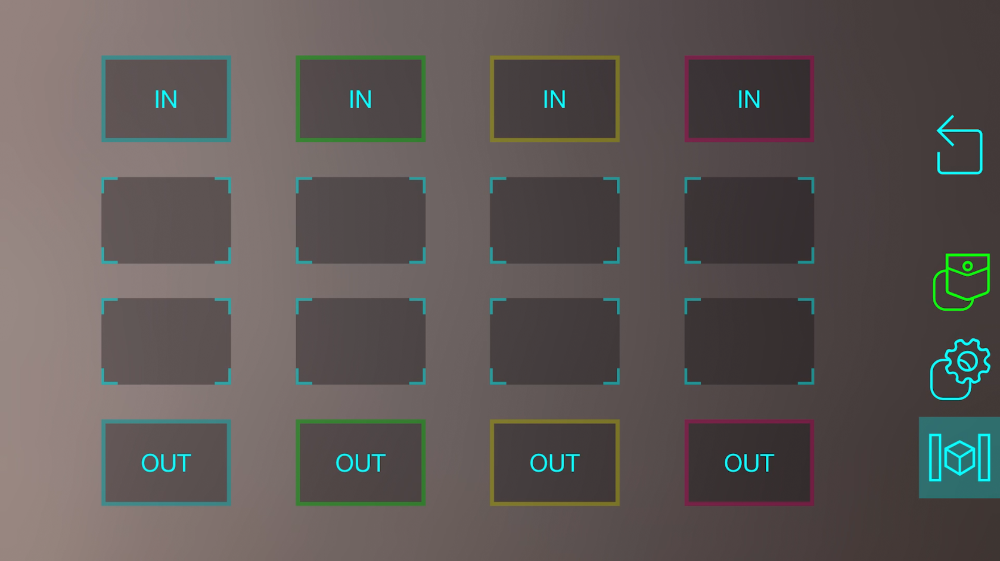
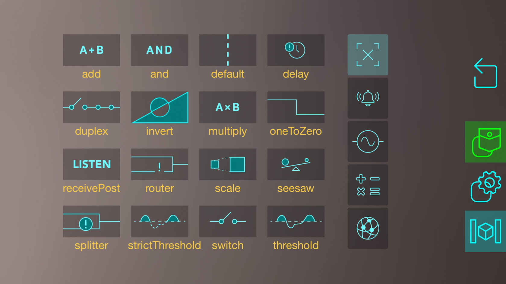

## Spatial Programming

As you have learned in the [Using the App](./using-the-app) guide, you can use **Logic Nodes** to
add more logic to the data passing through the system.

When you tap on a Logic Node, you'll see its programming grid (sometimes referred to as a "Logic
Crafting Board"):

To learn how to perform basic user interactions with it, refer back to the
[Using the App](./using-the-app) guide. This section will focus instead on how to use each Logic
Block.

For a reference list of what each block does, consult the
[Logic Blocks Reference List](./logic-blocks).

For some useful example programs constructed out of a set of logic blocks, consult the 
[Example Logic Node Programs](./example-programs).
