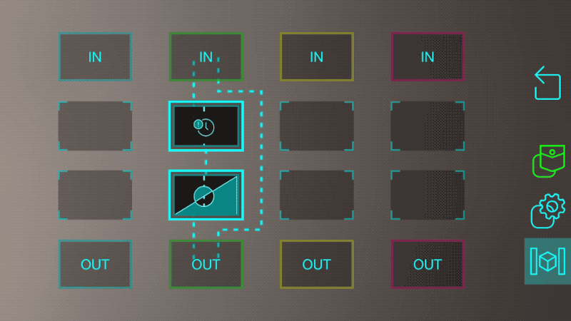
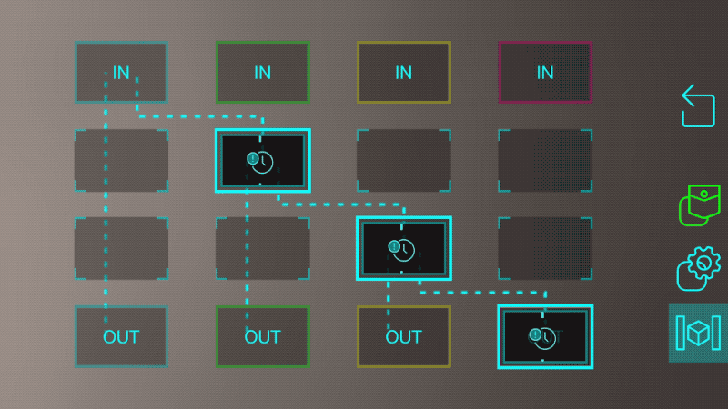
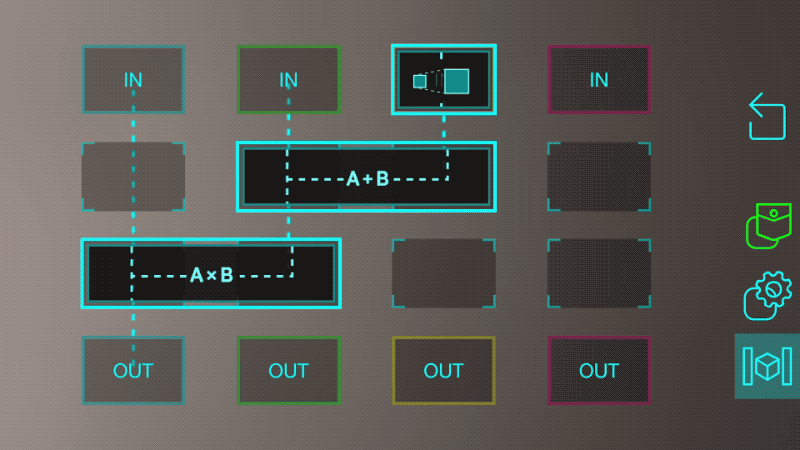
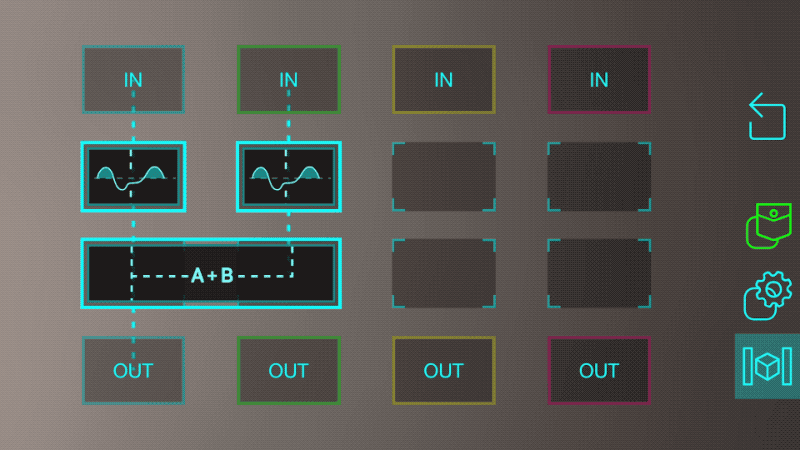

## Logic Node Example Programs

This is a curated set of useful programs that can be constructed in Logic Nodes. Read through the examples to see how logic node programming works and how it can be used for a variety of tasks. For full documentation on what each block does, visit the [Logic Blocks](https://github.com/ptcrealitylab/vuforia-spatial-toolbox-documentation/blob/master/use/toolboxBlocks.md) page.

## Start and Stop



This program uses a delay block and an inverter to trigger an action, and then stop it a few seconds later.

Imagine that you connect the green input to a button and the green output to a light. When you press the button, a 1 arrives in the green input and immediately turns the light on because of the link from green IN to green OUT. But it also sends a 1 to the delay block, which will wait a few seconds and then send the 1 to the inverter block. This changes the 1 to a 0 and sends it to green OUT, which turns the light back off.

The amount of time the light stays on can be changed by tapping on the delay block and choosing a number of seconds.

## Delay Chain



This program lets a single action trigger a sequence of events with delays in between each one.

Imagine you connect a button to the blue input, and lights to each of the outputs. This will immediately turn on the first light (because of the direct link from blue IN to blue OUT. It also trigger the delay in the green column, which will wait a second before activating the light connected to green OUT. The green then triggers the yellow delay block, which does the same for the red, eventually turning on all the lights.

## Math



There are a few blocks to perform different math operations on incoming values. This program uses a scale, add, and multiply block to compute the value sent to blue OUT. As an example, imagine the blue, green, and yellow inputs are connected to sensors, the blue output is connected to a light, and the scale block has a scale factor of 3 (you can change this by tapping on the block). 

In this case, the blocks compute the function:

```
Blue OUT = Blue IN  x  (Green IN  +  (3  x  Yellow IN))
```

## If Both Are On...


This program is useful in a lot of situations where you want to know if two objects are both "on" (meaning they have values of 1, or at least something above a certain threshold). You connect one object to the blue input, the other to the green input, and the blue output will give you a 1 if they are both on, or a 0 otherwise.

You can see how useful a single block can be.

## If Either Are On...



There isn't a corresponding "OR" block to match the "AND" block used in the previous example (if you're a developer, you can learn to build one and add it to your system [in this tutorial]()).

However, we can still build that functionality by composing a few blocks together.

This works by sending each link through a threshold block set to "digital" mode. These will output a 1 if the data is above 0.5 (or whatever threshold chosen in the settings), or a 0 otherwise. The two results are then added together. 

If we add them together, the only time the sum will be 0 is when both objects are off. Otherwise, the sum will be 1 (if only one of them is on) or 2 (if both are on). The block keeps the output within the range of 0 to 1 so it will actually be 1 even if both are on.

This is a good example of combining some simple blocks in a creative way to add your desired logic into the system.
