# Logic Blocks

Reference documentation about the functionality of each block in system.

|   |   |   |
|---|---|---|
|Add|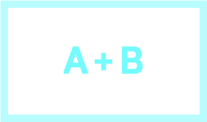|Outputs the sum of its two inputs.|
|And||Outputs a 1 if both inputs are at least 0.5. If either input is less than 0.5 it outputs a 0.|
|Default|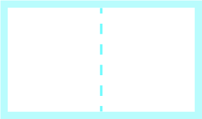|Outputs the same input with no processing. Placeholder block.|
|Delay|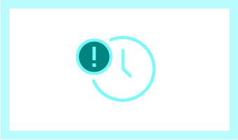|Outputs the same input after a certain delay. You can set this delay in seconds in its settings.|
|Duplex|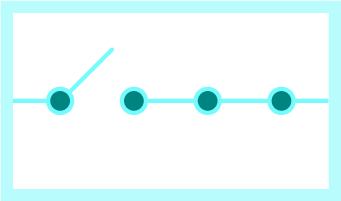|A duplex switch switches to either output its second input or its third input based on whether its first input is lower or higher than 0.5, respectively.|
|Invert||Inverts received data, so a 1 becomes a 0. Specifically, it outputs 1 minus the received value. For example, 0.2 becomes 0.8, and 0.5 remains 0.5.|
|Multiply|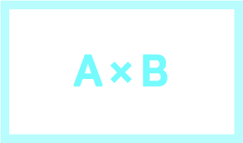|Outputs the product of its two inputs.|
|One to Zero||Detects when something turns off. Specifically outputs a single 1 value if the previous input value was a 1 and the new input value is a 0. Otherwise it outputs a 0 regardless of what data it receives.|
|Receive POST||A developer block that can be triggered by a web service that makes a POST request to the endpoint that will appear in its settings (visible when you tap on the block). It will output the value sent to it.|
|Router|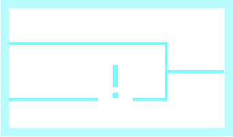|The first input is used to toggle which output the second input gets sent to. If a high value (>= 0.5) is sent into the first input, all values that arrive at the second input will go to the *first* output. If a low value is sent into the first input, all values that arrive at the second input will go to the *second* output.|
|Scale|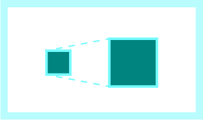|Outputs the input value multiplied by a scale factor. You can set the scale factor in its settings.|
|Seesaw|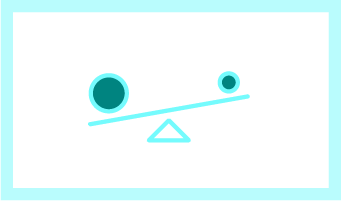|A specific kind of switch, where the first two inputs control whether to stream data through the third input to the third output. Sending a high value (>=0.5) to the first input turns it *off*. Sending a high value to the second input turns it *on*. If the switch is off, nothing will emit from the third output.|
|Splitter|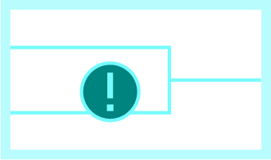|Sends a 0 to the first output and a 1 to the second output if the input is high (>= 0.5). It does the opposite if the input is low. It sends a 1 to the first and a 0 to the second.|
|Strict Threshold||Similar to the *threshold* block, except when the input is less than the threshold doesn't output anything, whereas the normal threshold will output a 0. Threshold can be configured in the settings.|
|Switch|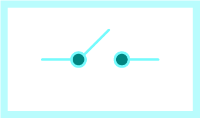|Can act as a toggle switch or a push switch based on the selected settings. If it's a toggle switch, every time the first input receives a high value, it will toggle on or off, whatever is the opposite of its current state. If it's a push switch, it will turn on or off based on if the first input is high or low. In either mode, it will output its state from the first output, and if it's on the second input will stream to the second output, but if it's off the second input does nothing.| 
|Threshold|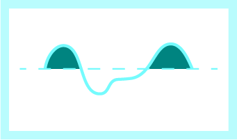|Outputs a value if it exceeds a certain threshold. The threshold and its direction (whether the values need to be *bigger* or *smaller* than it) can be changed in the settings. An additional setting switches between "digital" mode (it will output a *1* if exceeds the threshold, 0 if not) and analog mode (it will output the *received value* if it exceeds, 0 if not).|
|Two-way Switch|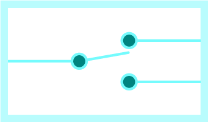|Switches on and off based on which input receives data. If the first input receives a high value and the switch is on, turns the switch off and outputs a 1 from the first output. If the second input receives a high value and the switch is off, turns the switch on and outputs a 0 from the first output.|
|Web POST||A developer tool that makes an HTTP request to a specified endpoint when data is received. The URL for that endpoint can be set in the block settings. The values will be sent in the blockData object within the request body JSON.|

