# Getting Started

## An illustrated guide to using the Vuforia Spatial Toolbox

The best way to get started is to...

You are now ready to use the Vuforia Spatial Toolbox. Open the iOS app and follow along to learn how to operate the user interface.

## Navigating the Menus

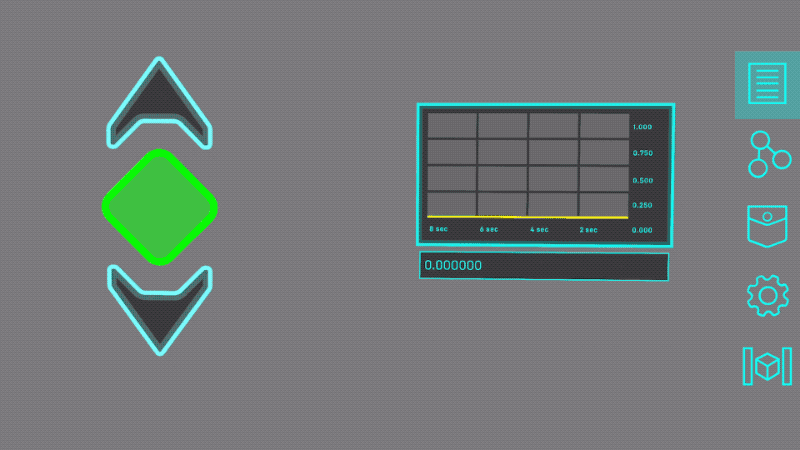

There are five menu buttons always present on the right side of the screen. Learning what each does will guide you through the interface.

- The **Interfaces** button displays any AR *tools* placed into the space.
- The **Programming** button displays the programming *nodes* and *links* for any of the tools you are currently looking at.
- The **Pocket** button opens a scrolling menu of tools that you can add to the space.
- The **Settings** button opens the settings menu, where you toggle between different options and modes.
- The **Freeze** button is a useful feature to pause the video background into a still image, so the AR content doesn't move when you move your device.

## The Basics

### Adding Tools

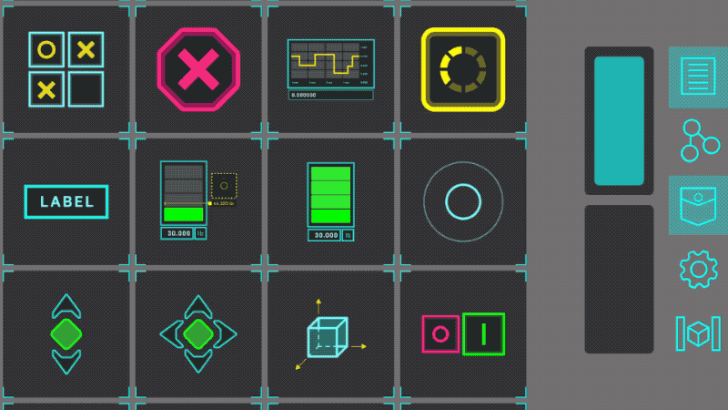

Tapping on an icon in the pocket will add that *tool* to the space.

You can then tap and hold on the tool for a moment (without moving your finger) to start moving it. Drag to move it horizontally and vertically. Pinch with two fingers to scale it up or down.

In this example, we add a slider tool and a graph tool, and organize them in our space.

### Drawing Links

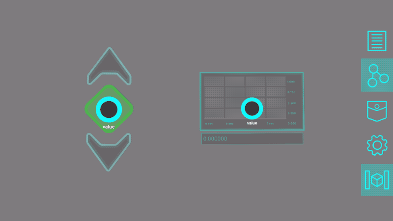

When you switch to programming mode, you will see the *nodes* for any visible tools.

You can connect any two nodes by dragging a line between them.

This creates a *link* that will send data from the first node (in this example, on the left) to the second (on the right). The direction matters, so the animated dots move in the direction that data will flow.

### Cutting Links

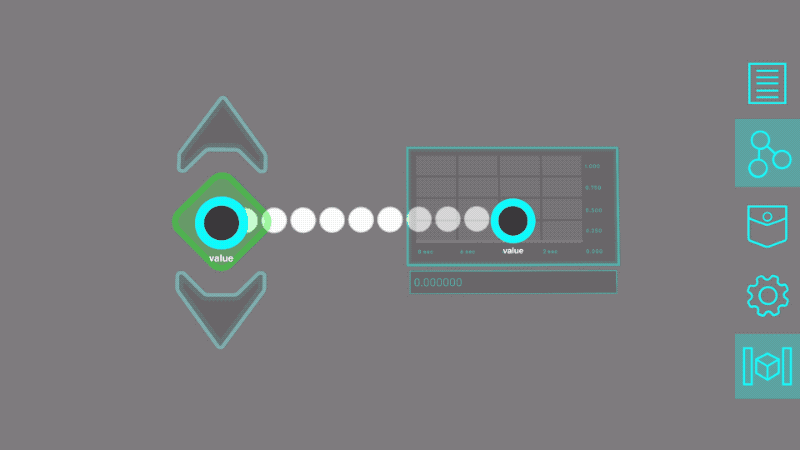

To delete a link, you can swipe through it to cut it.

The node on the left will no longer send data to the one on the right.

### Moving Nodes

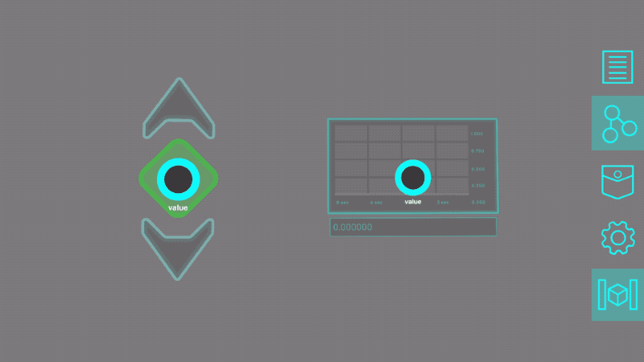

If you tap and hold on a node for a second without moving your finger, you can then reposition it by dragging it around. Blue corners will appear around the node to show that you can move it.

The position doesn't affect the behavior, but it can be useful to keep the nodes organized.

### Interacting with Tools

Some tools – like the graph – just visualize data. Others – like the slider – are inputs that we can interact with. By linking the input tool to the output tool, we can visualize the data that the input generates.

Before interacting with tools, remember to switch back from the programming mode to the interfaces mode.

### Fast-adding Tools

Instead of tapping on a tool's icon in the pocket, if you tap-and-hold and *drag* the tool all in one gesture, you will be able to move and scale the tool all at once. This is just a shortcut if you want to quickly add tools to the space.

### Linking Multiple Tools

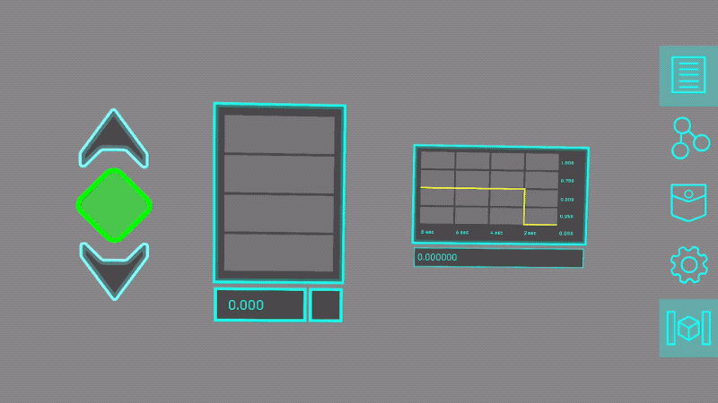

You can each node functions both as an input and an output, so you can string together tools' nodes into longer programs.

In this example, the value from the slider is visualized first by a simple meter, and then gets passed to a time-series graph to be visualized in a different way.

### Deleting Tools

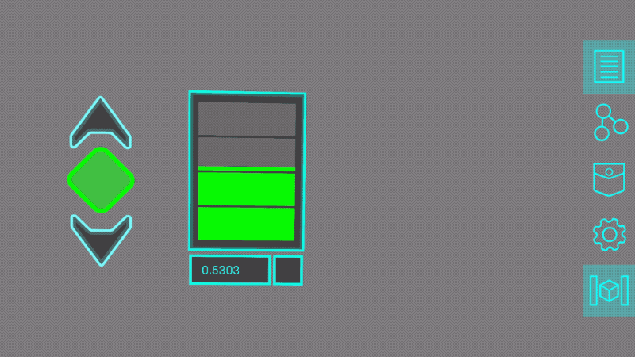

When dragging a tool around, a trash icon will appear on the right edge of the screen. Drag the tool on top of the icon and let go to delete it.

This will also delete all links to or from the nodes of this tool.

## Logic Nodes

Links just send data between nodes without affecting the data along the way. To add more logic to your system, you can add a *Logic Node* and pass the data through the logic node.

This part of the guide will teach you the basics of a block-based programming environment that lets you add all sorts of logic to your systems.

### Add Logic Node

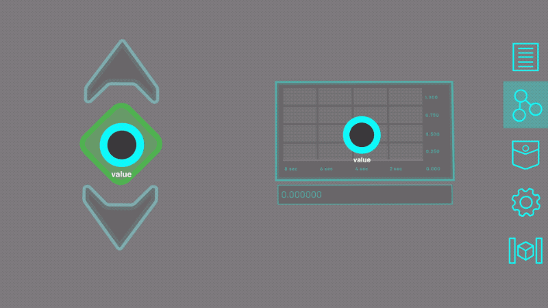

When you're in programming mode, dragging out from the pocket button will create a new logic node that you can place into space. There needs to be at least one tool in the space first, for the logic node to attach to, but you can add as many logic nodes as you want.

### Link to the Logic Node

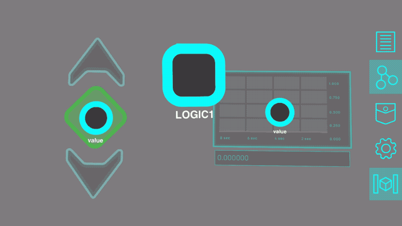

Creating a link to a logic node lets you choose a color for it: blue, green, yellow, or red. You can also choose a color for links drawn out of a logic node. The color of this link determines which color-coded entry point it will connect to within the logic node.

In this example, we send the data from the slider into the blue input, and send data from the green output to the graph.

### Open the Logic Node

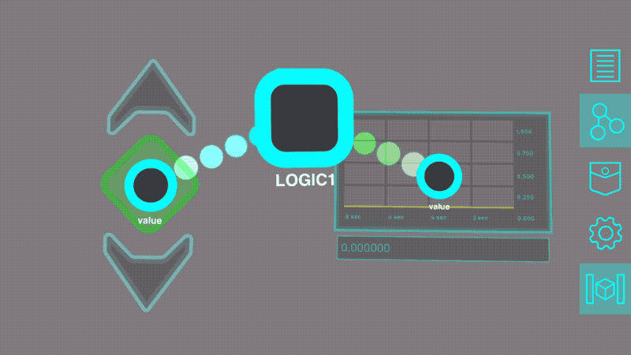

Tapping on a logic node opens its programming grid, where you can construct a program that affects the data flowing from its inputs to its outputs. You can place *logic block* into this grid, and link them together into programs.

The top row has an input spot for each color, corresponding to the colors of links connecting to this logic node.

The bottom row has an output spot for each color.

### Add Logic Block from Menu

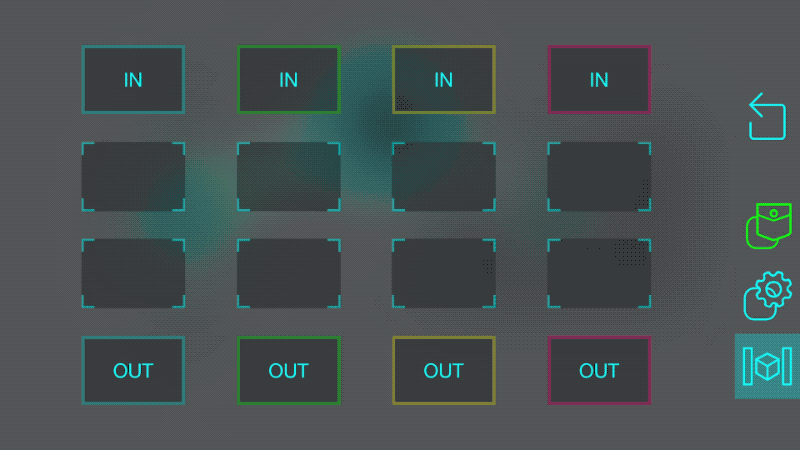

Tapping on the pocket button within a logic node opens the logic menu, where you can see a set of logic blocks that you can choose from.

Tap down and drag a logic block to select it. Dragging it around will snap it into different grid spots that it gets close to. Let go of it while it is snapped onto a spot in order to place it.

In this example, we select an inverter block, and place it into the grid.

A full list of blocks, and how to use them, can be seen [here]().

### Link Blocks to Inputs and Outputs

Drawing lines between blocks, input spots, or output spots will create a link. To create a working program, you need to make a path from an input to an output.

Since we connected the slider to the blue input of the logic node, and the graph to the green output, we link the blue input spot to the inverter block, and then link the block to the green output spot.

This will send inverted values from the slider to the graph.

### Move Logic Block

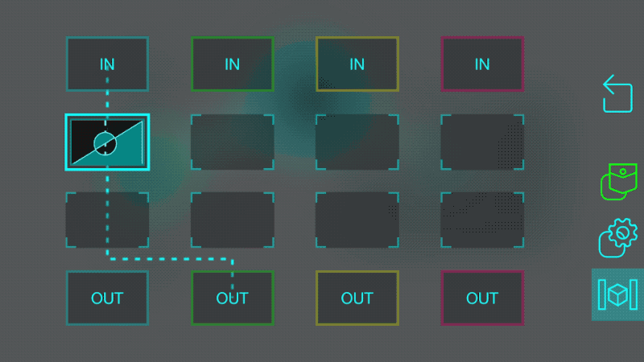

Tapping and holding on a block for a second will allow you to pick it up and move it to a different spot. The location you choose doesn't matter (unless you place it on an input or output spot) but it helps to organize them.

If you place it on an input spot, it will automatically link it to that input. If you place it on an output spot, it will automatically link it to that output.

### Logic Block Information

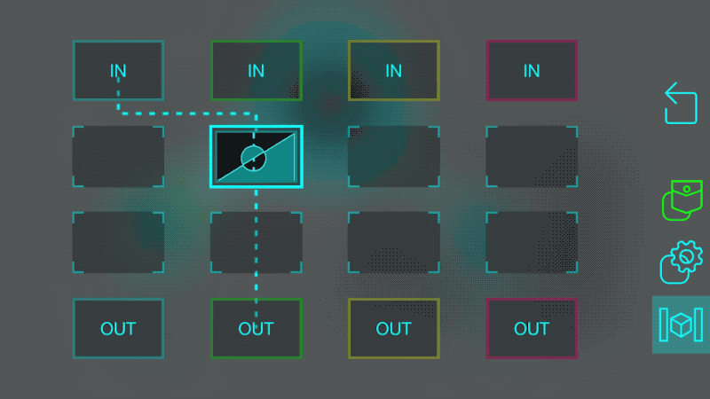

If you tap on a placed logic block (without holding), it will open the information and settings page for that block. For example, tapping on the inverter block explains what the block does. The inverter block doesn't have any settings that can be changed.

Tapping the back button closes the information. Tapping it again would exit the logic node entirely.

### Logic Block Settings

Some logic blocks have settings that you can change by tapping on them.

In this example, we add another block to the grid: a delay block that will output whatever data is sent to it after a certain amount of time. By tapping on the block, we can change that amount of time.

### Adjust Block Links

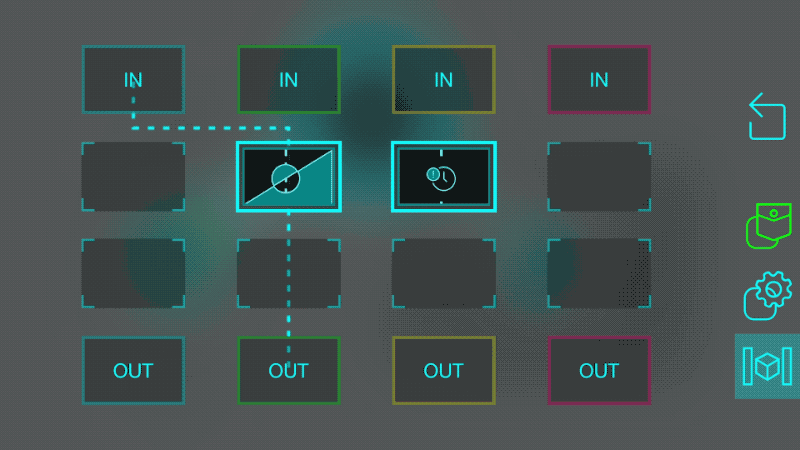

A link between blocks can be deleted in a similar way as those between nodes: just swipe to cut the line.

Blocks can also be linked together, to compose their effects into a more complicated program.

In this example, the data from the blue input first gets inverted, and then gets sent into the delay block. After a few seconds, the delay block will send the inverted data to the green output. 

### Delete Blocks

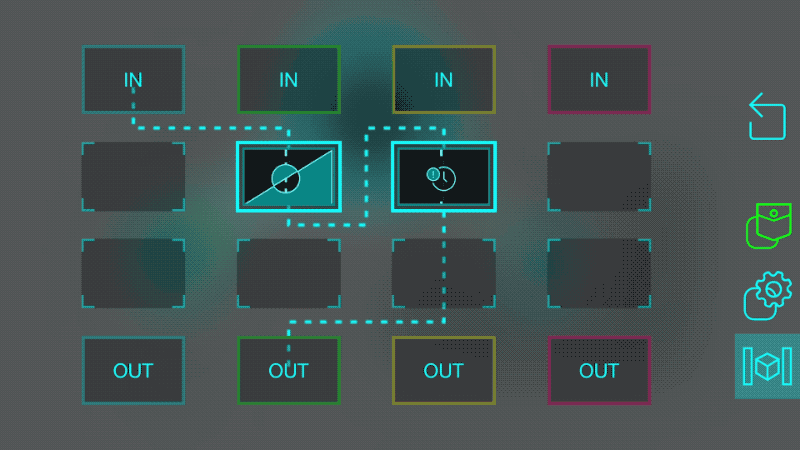

When moving a block around, a trash icon will appear on the right edge of the screen. Drag the block onto that icon and let go to delete it (and all the links to or from that block).

### Delete Logic Node

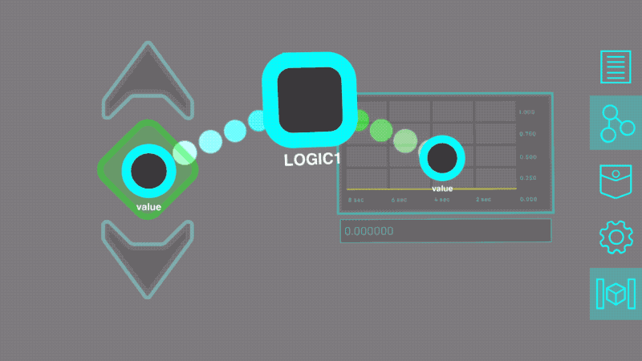

Logic nodes can be moved around by tapping and holding on them, just like regaular nodes. Regular logic nodes cannot be deleted, but logic nodes can. Drag a logic node onto the trash icon on the right edge of the screen to delete it and the links connected to it.
